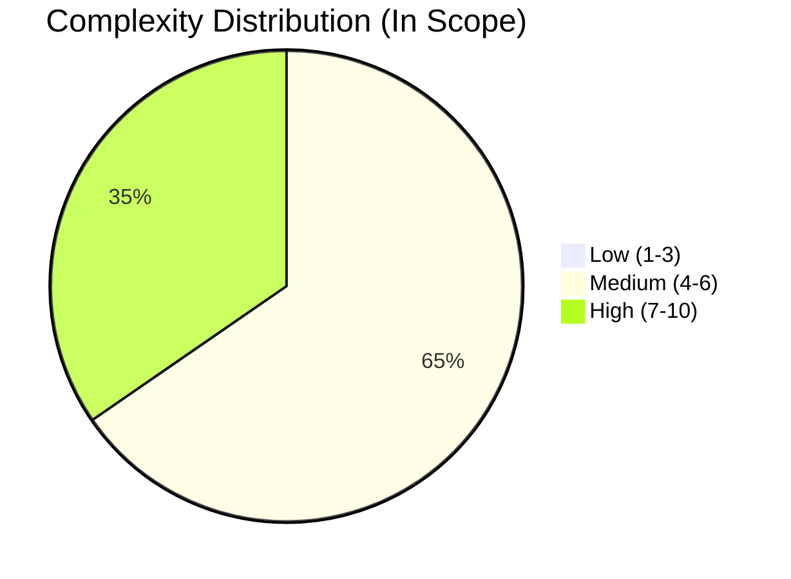
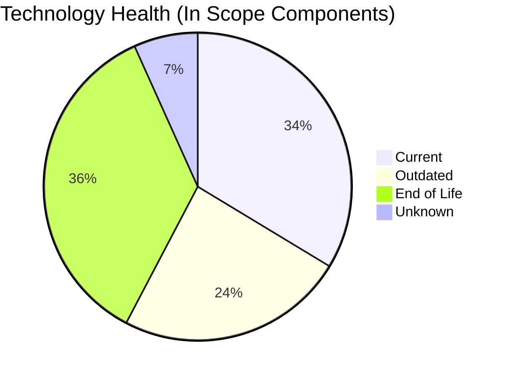

# Portfolio Modernization Report

**Generated:** 2026-05-19  
**Total Portfolio:** 30  
**Applications Analyzed (In Scope):** 26

## Executive Summary

The portfolio discovery analysis used `discover/input/apps_db_complete.xlsx` as input.  
Out of 30 applications, 4 are retired and 26 are in scope for modernization assessment.  
Technology lifecycle risk is high, with 37 EOL component findings and 25 outdated component findings across in-scope applications.  
Financial analysis identifies 25 applications with modernization opportunities, with an estimated one-time investment of 5,308,379 and yearly savings of 2,825,600, reaching break-even in 1.9 years.

## Portfolio Overview

## Top Modernization Opportunities

| Scenario | Applicable Apps |
|----------|-----------------|
| os_update_security_patch | 15 |
| application_server_replacement | 14 |
| app_containerization | 13 |
| app_deployment_to_cloud | 12 |
| app_refactor_decoupling | 11 |
| upgrade_legacy_databases | 11 |

## Financial Summary

| Metric | Value |
|--------|-------|
| Total One-Time Investment | 5,308,379 |
| Total Annual Savings | 2,825,600 |
| Portfolio Break-Even | 1.9 years |

## Notes

- Missing finance configuration prevented cost/savings roll-up for:
  - `switch_db_engine_open_source`
  - `update_outdated_components`
