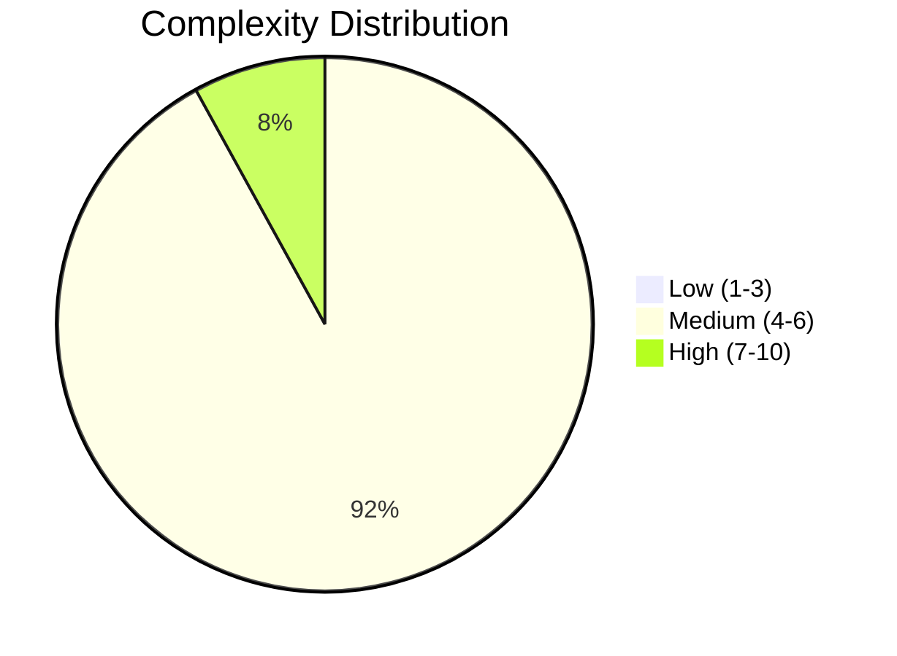
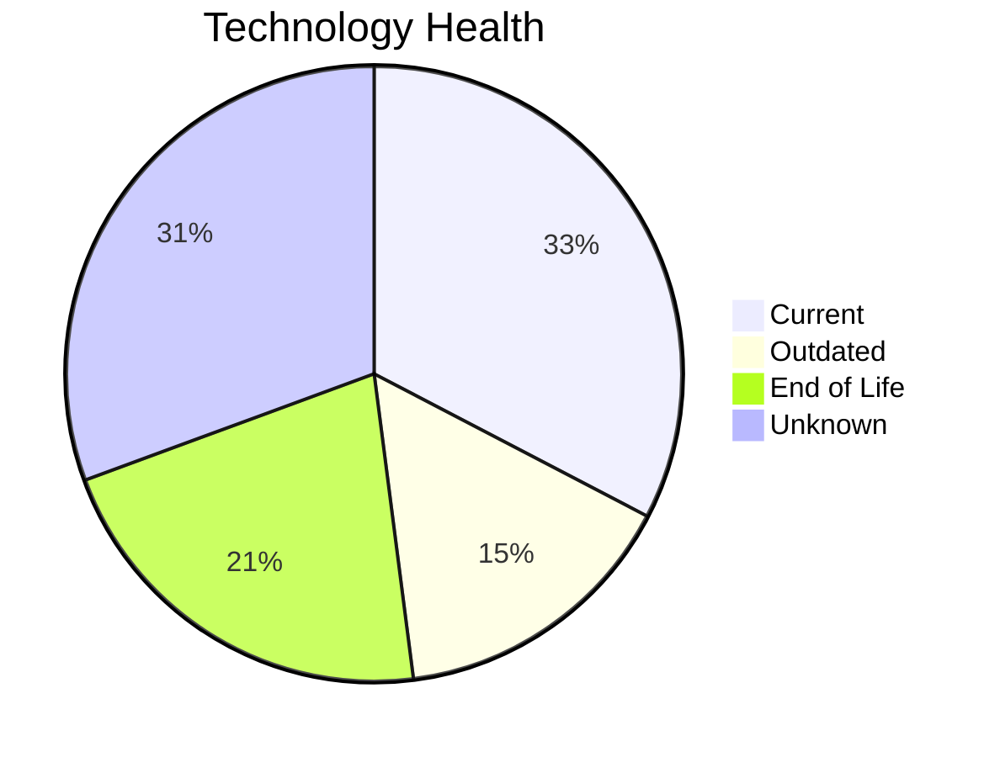
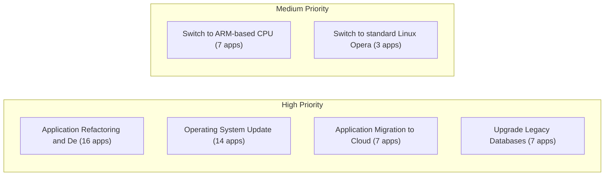
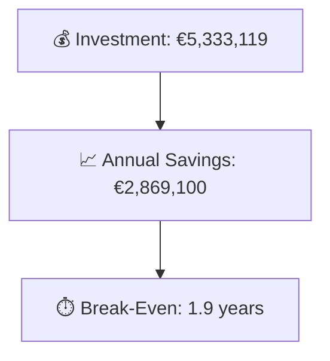

# Portfolio Modernization Report

**Generated:** 2026-04-24
**Applications Analyzed:** 25 (in-scope) / 30 (total)

## Executive Summary

The portfolio consists of **30 applications**, of which **25 are in scope** for modernization assessment (4 applications are retired and excluded). Analysis reveals significant modernization opportunities: **22 applications** have at least one applicable modernization scenario, with a total of **61 scenario instances** identified across the portfolio. The most critical risks are found in applications running EOL operating systems (RHEL 7, CentOS 7, Debian 6/7, Windows Server 2012, AIX 6), EOL databases, and outdated programming languages. The total estimated one-time investment is **€5,333,119** with **€2,869,100 in annual savings**, yielding a portfolio break-even of approximately **1.9 years**. Top priorities include OS updates, switching to open-source databases, and containerization of custom applications.

## Portfolio Overview

## Top Modernization Opportunities

| Scenario | Applicable Apps | Priority | Total Cost | Yearly Savings | ROI |
|----------|----------------|----------|------------|---------------|-----|
| Application Refactoring and De-coupling | 16 | High | €4,372,712 | €2,145,000 | 2.0y |
| Operating System Update | 14 | High | €15,789 | €7,000 | 2.3y |
| Application Migration to Cloud Infrastructure (Lift & Shift) | 7 | High | €39,726 | €18,900 | 2.1y |
| Upgrade Legacy Databases | 7 | High | €81,182 | €70,000 | 1.2y |
| Switch to ARM-based CPU | 7 | Medium | €39,083 | €7,000 | 5.6y |
| Application Containerization | 7 | High | €783,631 | €620,000 | 1.3y |
| Switch to standard Linux Operating System | 3 | Medium | €996 | €1,200 | 0.8y |

## Scenario Applicability Matrix

| Application | Operating System Upd | Switch to standard L | Switch to ARM-based  | Applications Server  | Application Migratio | Application Containe | Application Refactor | Upgrade Legacy Datab | Switch DB Engine to  | Update outdated comp |
|-------------|:---:|:---:|:---:|:---:|:---:|:---:|:---:|:---:|:---:|:---:|
| ERPApp-001 | ✅ | ✅ | 🚫 | ❌ | ✅ | 🚫 | ✅ | ✔️ | ✅ | ✅ |
| CRMApp-002 | ✅ | ✔️ | ❌ | ❓ | ✔️ | ❌ | ❌ | ✔️ | ❌ | ❌ |
| HRApp-004 | ✅ | ❌ | 🚫 | ❓ | ✔️ | ✔️ | ✅ | ✔️ | ✅ | ❓ |
| SupportApp-006 | ✅ | ✔️ | ❌ | ❓ | ✔️ | ❌ | ❌ | ✅ | ❌ | ❌ |
| InventoryApp-008 | ✅ | ✅ | 🚫 | ❓ | ✅ | 🚫 | ✅ | ✔️ | ✅ | ✅ |
| PayrollApp-010 | ✔️ | ❌ | ❌ | ❓ | ✔️ | ❌ | ❌ | ✔️ | ❌ | ❌ |
| RouteOptApp-011 | ✅ | ✔️ | ✅ | ❓ | ✔️ | ✔️ | ✅ | ✔️ | ✔️ | ✅ |
| IoTSensorApp-012 | ✔️ | ❌ | 🚫 | ❓ | ✔️ | ✔️ | ✅ | ✔️ | ✔️ | ✅ |
| SecurityApp-013 | ✅ | ✔️ | ✅ | ❓ | ✅ | 🚫 | ✅ | ✔️ | ✅ | ✅ |
| DocumentApp-014 | ✔️ | ❌ | 🚫 | ❓ | ✔️ | ✅ | ❓ | ✔️ | ✔️ | ✅ |
| ReportingApp-015 | ✔️ | ❌ | 🚫 | ❓ | ✔️ | ✅ | ✅ | ❓ | ✔️ | ✅ |
| MobileApp-016 | ✅ | ✔️ | ✅ | ❓ | ✔️ | ✔️ | ✅ | ✔️ | ✅ | ❓ |
| BackupApp-017 | ✅ | ✔️ | ❌ | ❓ | 🚫 | ❌ | ❌ | ✅ | ❌ | ❌ |
| VendorApp-018 | ✅ | ✔️ | ✅ | ❓ | ✅ | ✅ | ✅ | ✅ | ✔️ | ✅ |
| QualityApp-019 | ✔️ | ✔️ | ✅ | ❓ | ✔️ | ✅ | ✅ | ✔️ | ✔️ | ✅ |
| TrainingApp-020 | ✅ | ❌ | ❌ | ❓ | ✔️ | ❌ | ❌ | ✅ | ❌ | ❌ |
| FleetApp-021 | ✔️ | ❌ | 🚫 | ❓ | ✅ | ✅ | ✅ | ✅ | ✅ | ✅ |
| ComplianceApp-022 | ✅ | ✔️ | ✅ | ❓ | ✔️ | ✔️ | ✅ | ✔️ | ✔️ | ✅ |
| ChatbotApp-023 | ✔️ | ✔️ | ❓ | ❓ | ✔️ | ✔️ | ❓ | ❓ | ✔️ | ✅ |
| AuditApp-024 | ✔️ | ❌ | 🚫 | ❓ | ✅ | ✅ | ✅ | ✅ | ✅ | ✅ |
| PortalApp-025 | ✔️ | ❌ | 🚫 | ❓ | ✔️ | ✔️ | ✅ | ✔️ | ✔️ | ❓ |
| LegacyFinApp-026 | ✅ | ✅ | 🚫 | ❌ | ✅ | 🚫 | ✅ | ❓ | ✅ | ✅ |
| DataWarehouseApp-027 | ✅ | ✔️ | ✅ | ❓ | ✔️ | ✅ | ✅ | ✔️ | ✅ | ✅ |
| NotificationApp-028 | ✔️ | ❌ | ❌ | ❓ | ✔️ | ✔️ | ❌ | ✔️ | ❌ | ❌ |
| APIGatewayApp-030 | ✔️ | ✔️ | ❓ | ❓ | ✔️ | ✔️ | ❓ | ✅ | ✔️ | ✅ |

Legend: ✅ Applicable | ❌ Not Applicable | ✔️ Already Fulfilled | 🚫 Blocked | ❓ Unknown/Lack of Data

## Financial Summary

| Metric | Value |
|--------|-------|
| Total One-Time Investment | €5,333,119 |
| Total Annual Savings | €2,869,100 |
| Portfolio Break-Even | 1.9 years |

## Risk Applications

Applications with the highest modernization complexity or most EOL components:

| Application | Complexity | EOL Components | Applicable Scenarios |
|-------------|-----------|---------------|---------------------|
| BackupApp-017 | 7/10 (HIGH) | 2 | 2 |
| DataWarehouseApp-027 | 7/10 (HIGH) | 1 | 6 |
| VendorApp-018 | 6/10 (MEDIUM) | 2 | 7 |
| TrainingApp-020 | 6/10 (MEDIUM) | 2 | 2 |
| HRApp-004 | 6/10 (MEDIUM) | 1 | 3 |
| InventoryApp-008 | 6/10 (MEDIUM) | 1 | 6 |
| SecurityApp-013 | 6/10 (MEDIUM) | 1 | 6 |
| DocumentApp-014 | 6/10 (MEDIUM) | 1 | 2 |
| FleetApp-021 | 6/10 (MEDIUM) | 1 | 6 |
| ComplianceApp-022 | 6/10 (MEDIUM) | 1 | 4 |

## Per-Application Reports

| Application | Report |
|-------------|--------|
| ERPApp-001 | [View Report](apps/app001.md) |
| CRMApp-002 | [View Report](apps/app002.md) |
| HRApp-004 | [View Report](apps/app004.md) |
| SupportApp-006 | [View Report](apps/app006.md) |
| InventoryApp-008 | [View Report](apps/app008.md) |
| PayrollApp-010 | [View Report](apps/app010.md) |
| RouteOptApp-011 | [View Report](apps/app011.md) |
| IoTSensorApp-012 | [View Report](apps/app012.md) |
| SecurityApp-013 | [View Report](apps/app013.md) |
| DocumentApp-014 | [View Report](apps/app014.md) |
| ReportingApp-015 | [View Report](apps/app015.md) |
| MobileApp-016 | [View Report](apps/app016.md) |
| BackupApp-017 | [View Report](apps/app017.md) |
| VendorApp-018 | [View Report](apps/app018.md) |
| QualityApp-019 | [View Report](apps/app019.md) |
| TrainingApp-020 | [View Report](apps/app020.md) |
| FleetApp-021 | [View Report](apps/app021.md) |
| ComplianceApp-022 | [View Report](apps/app022.md) |
| ChatbotApp-023 | [View Report](apps/app023.md) |
| AuditApp-024 | [View Report](apps/app024.md) |
| PortalApp-025 | [View Report](apps/app025.md) |
| LegacyFinApp-026 | [View Report](apps/app026.md) |
| DataWarehouseApp-027 | [View Report](apps/app027.md) |
| NotificationApp-028 | [View Report](apps/app028.md) |
| APIGatewayApp-030 | [View Report](apps/app030.md) |
