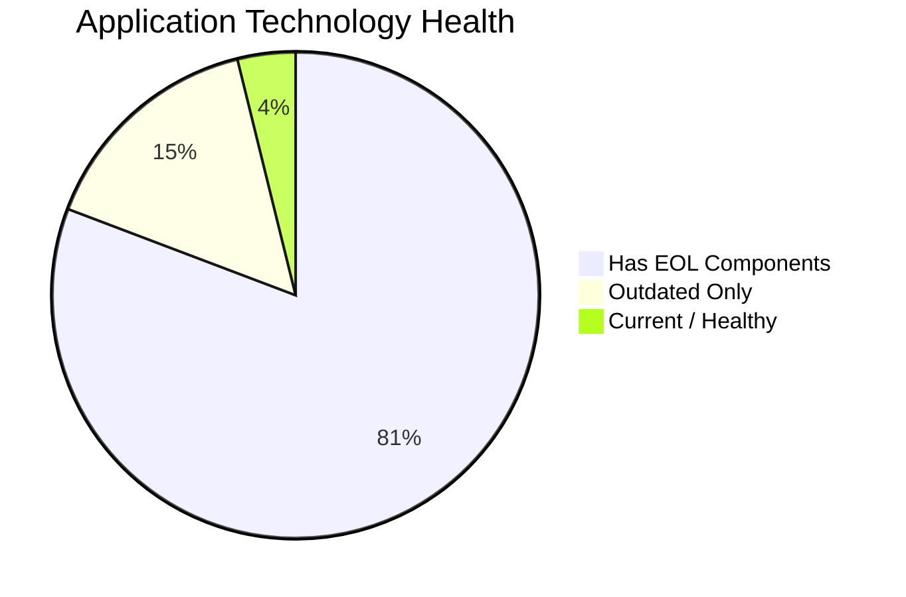
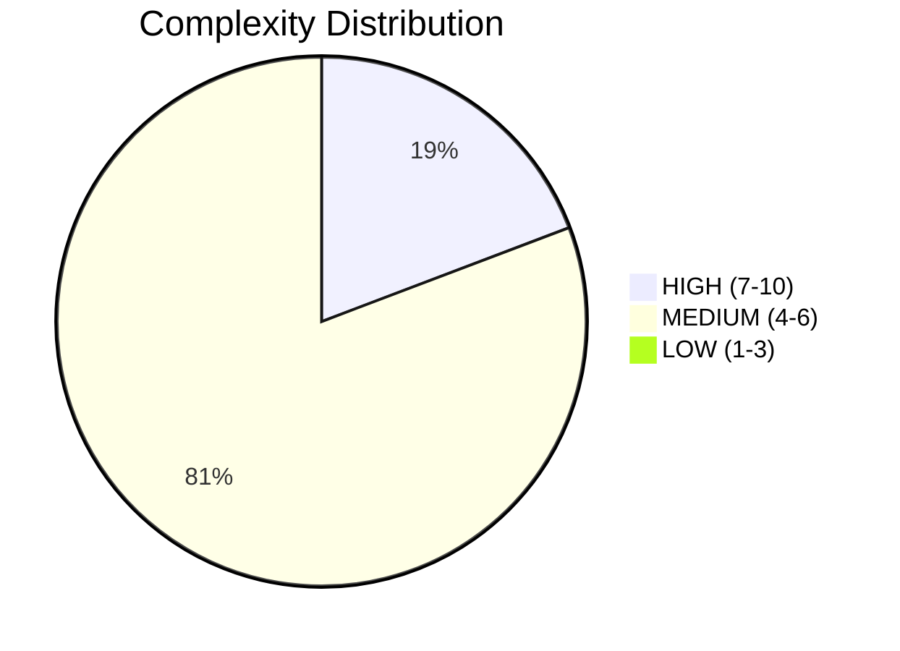

# Portfolio Modernization Report

**Generated:** 2026-05-15  
**Total Applications:** 30  
**In-Scope Applications:** 26  
**Out-of-Scope (Retired):** 4

---

## Executive Summary

This portfolio assessment covers **26 production applications** across multiple business units. The analysis identified significant modernization opportunities: **21 applications** contain End-of-Life components and **4 applications** have outdated but still-supported stacks.

The total estimated modernization investment is **€3,035,448** with projected annual savings of **€1,712,600**, yielding an estimated ROI break-even of **1.8 years**.

## Portfolio Health Overview

## Deployment Landscape

| Deployment Type | Count |
|-----------------|-------|
| AWS | 18 |
| On-Premise | 8 |
| On-premise | 4 |

## Technology Risk Summary

- **21 applications** have at least one EOL component — **immediate action required**
- **4 applications** have outdated (but still-supported) components
- **1 applications** have a current technology stack
- **5 applications** are HIGH complexity (score 7-10)
- **21 applications** are MEDIUM complexity (score 4-6)
- **0 applications** are LOW complexity (score 1-3)

### Applications with EOL Components

| App ID | App Name | Complexity | Critical EOL Components |
|--------|----------|-----------|-------------------------|
| app001 | ERPApp-001 | 7/10 (HIGH) | COBOL-2014 |
| app002 | CRMApp-002 | 6/10 (MEDIUM) | RHEL 7, Websphere 7.0 |
| app003 | AnalyticsApp-003 | 4/10 (MEDIUM) | RHEL 7, Apache Tomcat 6.1 |
| app004 | HRApp-004 | 7/10 (HIGH) | Windows Server 2012, .NET Core, Microsoft IIS 8.0 |
| app006 | SupportApp-006 | 5/10 (MEDIUM) | Debian 6 |
| app008 | InventoryApp-008 | 7/10 (HIGH) | AIX 6, COBOL-2014, Oracle Weblogic 8.0 |
| app010 | PayrollApp-010 | 5/10 (MEDIUM) | Ruby 2.7 |
| app011 | RouteOptApp-011 | 5/10 (MEDIUM) | CentOS 7, Glassfish 4.0 |
| app013 | SecurityApp-013 | 6/10 (MEDIUM) | Debian 7, Websphere 8.0 |
| app014 | DocumentApp-014 | 6/10 (MEDIUM) | C# .NET 6 |
| app016 | MobileApp-016 | 5/10 (MEDIUM) | RHEL 7, Payara 4.0 |
| app017 | BackupApp-017 | 7/10 (HIGH) | RHEL 7, Oracle 12c |
| app018 | VendorApp-018 | 6/10 (MEDIUM) | RHEL 7, Glassfish 4.5 |
| app019 | QualityApp-019 | 5/10 (MEDIUM) | Python 3.8, Apache Tomcat  8.0 |
| app020 | TrainingApp-020 | 6/10 (MEDIUM) | Windows Server 2012, Angular 15, Microsoft IIS 8.5 |
| app021 | FleetApp-021 | 6/10 (MEDIUM) | Oracle 11g |
| app022 | ComplianceApp-022 | 6/10 (MEDIUM) | RHEL 7 |
| app023 | ChatbotApp-023 | 5/10 (MEDIUM) | Apache Tomcat. 7.4 |
| app024 | AuditApp-024 | 6/10 (MEDIUM) | VB.NET, SQL Server 2014 |
| app027 | DataWarehouseApp-027 | 6/10 (MEDIUM) | RHEL 7 |
| app030 | APIGatewayApp-030 | 7/10 (HIGH) | Go 1.19, Glassfish 3.0, MySQL 5.7 |

## Modernization Scenario Analysis

| Scenario | Applicable Apps | Total Investment | Annual Savings | ROI (years) |
|----------|----------------|-----------------|----------------|-------------|
| Switch to ARM-based CPU | 18 | €96,968 | €18,000 | 5.4 |
| Operating System Update | 15 | €17,312 | €7,500 | 2.3 |
| Upgrade Legacy Databases | 14 | €159,771 | €140,000 | 1.1 |
| Applications Server replacement | 11 | €123,568 | €115,200 | 1.1 |
| Application Migration to Cloud Infrastructure (Lift & Shift) | 8 | €48,865 | €20,700 | 2.4 |
| Application Containerization | 7 | €766,283 | €630,000 | 1.2 |
| Application Refactoring and De-coupling | 6 | €1,821,536 | €780,000 | 2.3 |
| Switch to standard Linux Operating System | 3 | €1,145 | €1,200 | 1.0 |

## Business Case Summary

| Metric | Value |
|--------|-------|
| Total Applications Assessed | 26 |
| Applications with Opportunities | 26 |
| Total Applicable Scenarios | 119 |
| Total One-time Investment | €3,035,448 |
| Total Annual Savings | €1,712,600 |
| ROI Break-even | 1.8 years |

## Per-Application Summary

| App ID | App Name | Complexity | Health | Applicable Scenarios | Est. Cost | Est. Savings/yr |
|--------|----------|-----------|--------|---------------------|-----------|-----------------|
| app001 | ERPApp-001 | 7/10 (HIGH) | 🔴 | 7 | €354,181 | €133,300 |
| app002 | CRMApp-002 | 6/10 (MEDIUM) | 🔴 | 3 | €6,940 | €1,500 |
| app003 | AnalyticsApp-003 | 4/10 (MEDIUM) | 🔴 | 5 | €22,738 | €22,300 |
| app004 | HRApp-004 | 7/10 (HIGH) | 🔴 | 5 | €21,280 | €11,100 |
| app006 | SupportApp-006 | 5/10 (MEDIUM) | 🔴 | 4 | €16,091 | €11,500 |
| app008 | InventoryApp-008 | 7/10 (HIGH) | 🔴 | 7 | €354,181 | €132,900 |
| app010 | PayrollApp-010 | 5/10 (MEDIUM) | 🔴 | 2 | €5,028 | €1,000 |
| app011 | RouteOptApp-011 | 5/10 (MEDIUM) | 🔴 | 5 | €26,148 | €22,300 |
| app012 | IoTSensorApp-012 | 6/10 (MEDIUM) | 🟡 | 3 | €17,348 | €11,000 |
| app013 | SecurityApp-013 | 6/10 (MEDIUM) | 🔴 | 6 | €134,158 | €104,000 |
| app014 | DocumentApp-014 | 6/10 (MEDIUM) | 🔴 | 3 | €121,436 | €91,000 |
| app015 | ReportingApp-015 | 4/10 (MEDIUM) | 🟡 | 3 | €91,823 | €91,000 |
| app016 | MobileApp-016 | 5/10 (MEDIUM) | 🔴 | 5 | €16,091 | €12,300 |
| app017 | BackupApp-017 | 7/10 (HIGH) | 🔴 | 5 | €21,280 | €12,900 |
| app018 | VendorApp-018 | 6/10 (MEDIUM) | 🔴 | 7 | €434,856 | €249,000 |
| app019 | QualityApp-019 | 5/10 (MEDIUM) | 🔴 | 4 | €115,653 | €101,800 |
| app020 | TrainingApp-020 | 6/10 (MEDIUM) | 🔴 | 5 | €18,505 | €11,500 |
| app021 | FleetApp-021 | 6/10 (MEDIUM) | 🔴 | 6 | €422,134 | €237,700 |
| app022 | ComplianceApp-022 | 6/10 (MEDIUM) | 🔴 | 4 | €18,505 | €11,500 |
| app023 | ChatbotApp-023 | 5/10 (MEDIUM) | 🔴 | 3 | €15,085 | €11,800 |
| app024 | AuditApp-024 | 6/10 (MEDIUM) | 🔴 | 5 | €306,481 | €147,700 |
| app025 | PortalApp-025 | 5/10 (MEDIUM) | 🟢 | 1 | €5,028 | €1,000 |
| app026 | LegacyFinApp-026 | 6/10 (MEDIUM) | 🟡 | 7 | €307,985 | €148,600 |
| app027 | DataWarehouseApp-027 | 6/10 (MEDIUM) | 🔴 | 6 | €134,158 | €102,300 |
| app028 | NotificationApp-028 | 5/10 (MEDIUM) | 🟡 | 4 | €15,085 | €11,000 |
| app030 | APIGatewayApp-030 | 7/10 (HIGH) | 🔴 | 4 | €33,250 | €20,600 |

## Out-of-Scope Applications

| App ID | App Name | Status | Reason |
|--------|----------|--------|--------|
| app005 | EComApp-005 | Retired | Application status marked as Retired |
| app007 | FinanceApp-007 | Retired | Application status marked as Retired |
| app009 | MarketingApp-009 | Retired | Application status marked as Retired |
| app029 | ConfigApp-029 | Retired | Application status marked as Retired |

---
*Report generated 2026-05-15 from portfolio analysis of apps_db_complete.xlsx*
