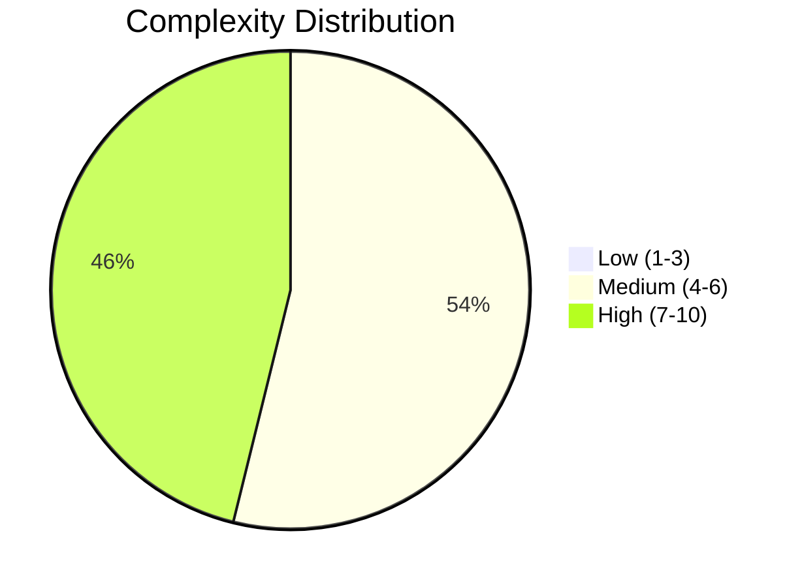
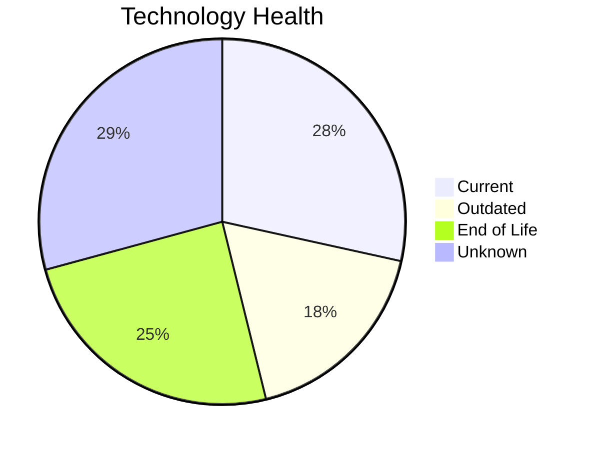
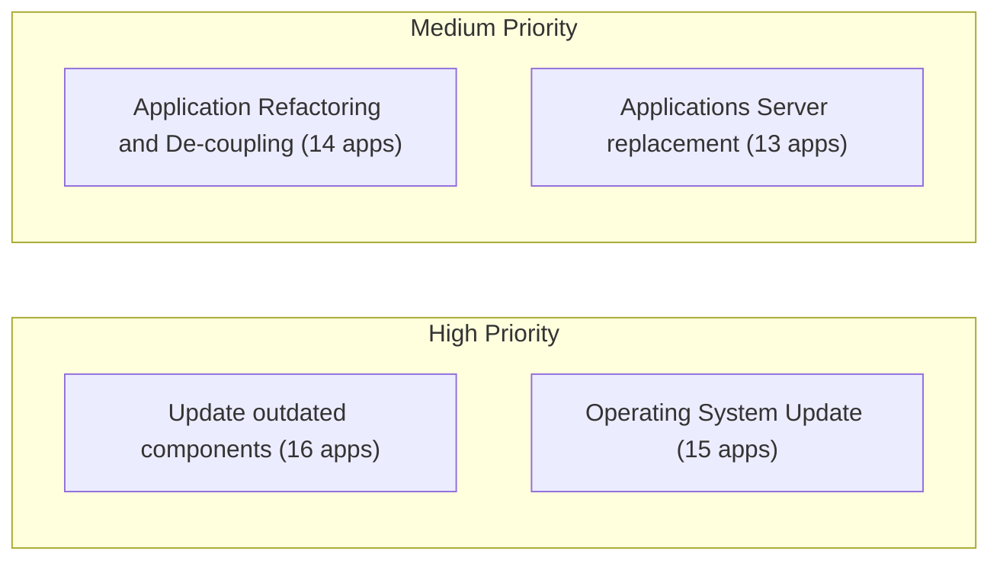
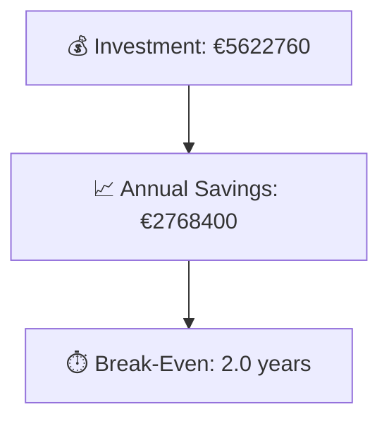

# Portfolio Modernization Report

**Generated:** 2026-05-15
**Applications Analyzed:** 26

## Executive Summary

30 applications were ingested, with 26 in scope after exclusions (retired/SAP). The portfolio shows 12 high-complexity applications and widespread lifecycle risk from legacy operating systems, application servers, and runtimes. Most near-term opportunities are application server replacement, outdated component updates, and database modernization; cloud migration is already fulfilled for many AWS-hosted workloads. Estimated one-time modernization investment is €5,622,760 with annual savings of €2,768,400, yielding an estimated break-even of 2.0 years. Confidence is moderate where version data is missing for managed databases/frameworks.

## Portfolio Overview

## Top Modernization Opportunities

| Scenario | Applicable Apps | Priority | Total Cost | Yearly Savings | ROI |
|----------|----------------|----------|------------|---------------|-----|
| Update outdated components | 16 | High | €0 | €0 | N/A |
| Operating System Update | 15 | High | €19361 | €7500 | 2.6y |
| Application Refactoring and De-coupling | 14 | High | €4183625 | €1830000 | 2.3y |
| Applications Server replacement | 13 | Medium | €172432 | €129600 | 1.3y |
| Upgrade Legacy Databases | 11 | High | €141842 | €110000 | 1.3y |
| Switch DB Engine to open-source database solution | 9 | High | €0 | €0 | N/A |
| Application Migration to Cloud Infrastructure (Lift & Shift) | 8 | High | €52595 | €20100 | 2.6y |
| Application Containerization | 8 | High | €1051864 | €670000 | 1.6y |
| Switch to standard Linux Operating System | 3 | Medium | €1041 | €1200 | 0.9y |

## Financial Summary

| Metric | Value |
|--------|-------|
| Total One-Time Investment | €5622760 |
| Total Annual Savings | €2768400 |
| Portfolio Break-Even | 2.0 years |

