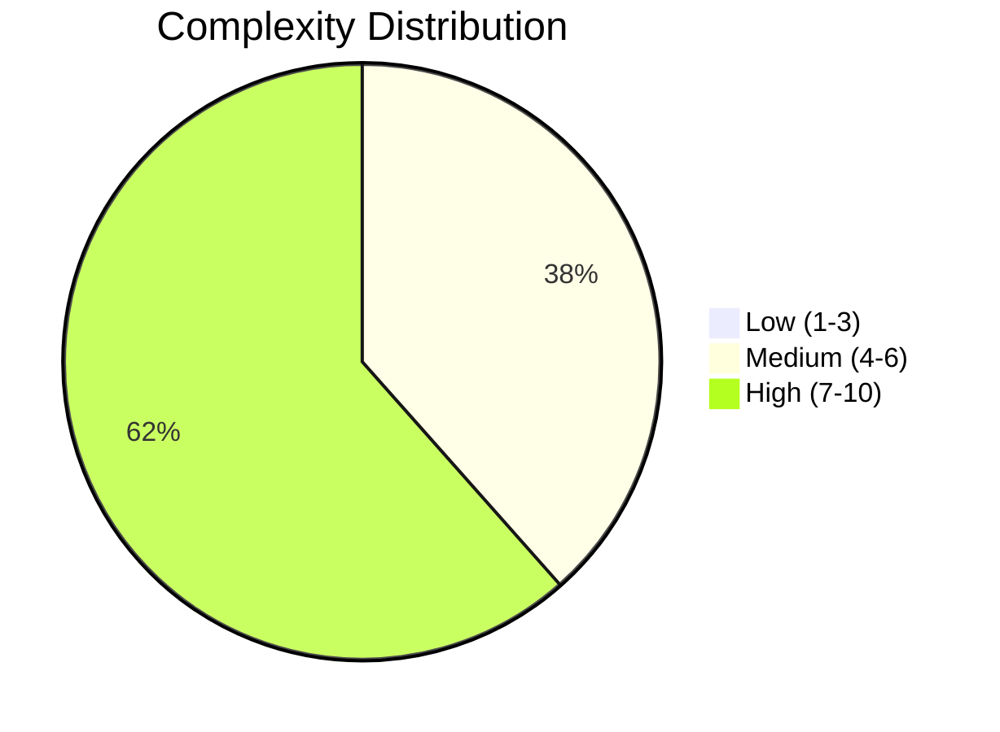
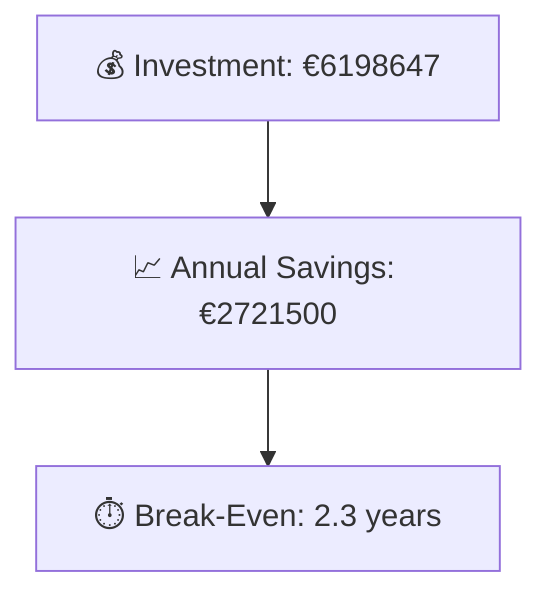

# Portfolio Modernization Report

**Generated:** 2026-05-17  
**Applications Analyzed:** 26

## Executive Summary

Total Portfolio: 30 (4 out-of-scope, 26 in-scope).
The portfolio contains 26 in-scope applications, with 21 applications already showing at least one end-of-life technology component.
The most frequent modernization opportunities are Operating System Update, Upgrade Legacy Databases, Application Refactoring and De-coupling, reflecting a mix of platform refresh, cloud, and application modernization needs.
Estimated one-time modernization cost is €6,198,647 against yearly savings of €2,721,500, resulting in a portfolio break-even of 2.3 years.

## Portfolio Overview

## Top Modernization Opportunities

| Scenario | Applicable Apps | Priority | Total Cost | Yearly Savings | ROI |
|----------|----------------|----------|------------|---------------|-----|
| Operating System Update | 21 | High | €27368 | €10500 | 2.6y |
| Upgrade Legacy Databases | 17 | High | €221902 | €170000 | 1.3y |
| Application Refactoring and De-coupling | 14 | High | €4631180 | €1740000 | 2.7y |
| Application Migration to Cloud Infrastructure (Lift & Shift) | 12 | High | €82058 | €29400 | 2.8y |
| Applications Server replacement | 11 | Medium | €145832 | €110400 | 1.3y |
| Application Containerization | 8 | High | €1089162 | €660000 | 1.7y |
| Switch to standard Linux Operating System | 3 | Medium | €1145 | €1200 | 1.0y |

## Scenario Applicability Matrix

| Application | Operating System Update | Upgrade Legacy Databases | Application Refactoring and De-coupling | Application Migration to Cloud Infrastructure (Lift & Shift) |
|-------------|:---:|:---:|:---:|:---:|
| ERPApp-001 | ✅ | ✔️ | ✅ | ✅ |
| CRMApp-002 | ✅ | ❓ | 🚫 | ✔️ |
| AnalyticsApp-003 | ✅ | ✅ | ❌ | ✔️ |
| HRApp-004 | ✅ | ✅ | ✅ | ✅ |
| SupportApp-006 | ✅ | ✅ | 🚫 | ✔️ |
| InventoryApp-008 | ✅ | ✅ | ✅ | ✅ |
| PayrollApp-010 | ✅ | ✅ | 🚫 | ✔️ |
| RouteOptApp-011 | ✅ | ✅ | ❌ | ✔️ |
| IoTSensorApp-012 | ✔️ | ✅ | ✅ | ✔️ |
| SecurityApp-013 | ✅ | ✔️ | ✅ | ✅ |
| DocumentApp-014 | ✅ | ✅ | ❌ | ✔️ |
| ReportingApp-015 | ✅ | ❓ | ✅ | ✔️ |
| MobileApp-016 | ✅ | ✅ | ✅ | ✔️ |
| BackupApp-017 | ✅ | ✅ | 🚫 | ✅ |
| VendorApp-018 | ✅ | ✅ | ✅ | ✅ |
| QualityApp-019 | ✔️ | ✅ | ❌ | ✅ |
| TrainingApp-020 | ✅ | ✅ | 🚫 | ✔️ |
| FleetApp-021 | ✔️ | ✅ | ✅ | ✅ |
| ComplianceApp-022 | ✅ | ✅ | ✅ | ✅ |
| ChatbotApp-023 | ✔️ | ❓ | ❌ | ✔️ |
| AuditApp-024 | ✅ | ✅ | ✅ | ✅ |
| PortalApp-025 | ✅ | ✔️ | ✅ | ✔️ |
| LegacyFinApp-026 | ✅ | ❓ | ✅ | ✅ |
| DataWarehouseApp-027 | ✅ | ✔️ | ✅ | ✅ |
| NotificationApp-028 | ✅ | ✔️ | 🚫 | ✔️ |
| APIGatewayApp-030 | ✔️ | ✅ | ❌ | ✔️ |

Legend: ✅ Applicable | ❌ Not Applicable | ✔️ Already Fulfilled | 🚫 Blocked | ❓ Unknown

## Financial Summary

| Metric | Value |
|--------|-------|
| Total One-Time Investment | €6198647 |
| Total Annual Savings | €2721500 |
| Portfolio Break-Even | 2.3 years |

## Risk Applications

Applications with the highest modernization complexity or most EOL components:

| Application | Complexity | EOL Components | Applicable Scenarios |
|-------------|-----------|---------------|---------------------|
| VendorApp-018 | 8/10 (HIGH) | 4 | 7 |
| APIGatewayApp-030 | 8/10 (HIGH) | 3 | 3 |
| DataWarehouseApp-027 | 8/10 (HIGH) | 2 | 7 |
| SecurityApp-013 | 8/10 (HIGH) | 2 | 7 |
| BackupApp-017 | 8/10 (HIGH) | 2 | 3 |
| TrainingApp-020 | 7/10 (HIGH) | 3 | 2 |
| InventoryApp-008 | 7/10 (HIGH) | 2 | 8 |
| HRApp-004 | 7/10 (HIGH) | 2 | 7 |
| MobileApp-016 | 7/10 (HIGH) | 2 | 6 |
| SupportApp-006 | 7/10 (HIGH) | 2 | 2 |

## Per-Application Reports

| Application | Report |
|-------------|--------|
| ERPApp-001 | [View Report](apps/app001.md) |
| CRMApp-002 | [View Report](apps/app002.md) |
| AnalyticsApp-003 | [View Report](apps/app003.md) |
| HRApp-004 | [View Report](apps/app004.md) |
| SupportApp-006 | [View Report](apps/app006.md) |
| InventoryApp-008 | [View Report](apps/app008.md) |
| PayrollApp-010 | [View Report](apps/app010.md) |
| RouteOptApp-011 | [View Report](apps/app011.md) |
| IoTSensorApp-012 | [View Report](apps/app012.md) |
| SecurityApp-013 | [View Report](apps/app013.md) |
| DocumentApp-014 | [View Report](apps/app014.md) |
| ReportingApp-015 | [View Report](apps/app015.md) |
| MobileApp-016 | [View Report](apps/app016.md) |
| BackupApp-017 | [View Report](apps/app017.md) |
| VendorApp-018 | [View Report](apps/app018.md) |
| QualityApp-019 | [View Report](apps/app019.md) |
| TrainingApp-020 | [View Report](apps/app020.md) |
| FleetApp-021 | [View Report](apps/app021.md) |
| ComplianceApp-022 | [View Report](apps/app022.md) |
| ChatbotApp-023 | [View Report](apps/app023.md) |
| AuditApp-024 | [View Report](apps/app024.md) |
| PortalApp-025 | [View Report](apps/app025.md) |
| LegacyFinApp-026 | [View Report](apps/app026.md) |
| DataWarehouseApp-027 | [View Report](apps/app027.md) |
| NotificationApp-028 | [View Report](apps/app028.md) |
| APIGatewayApp-030 | [View Report](apps/app030.md) |
