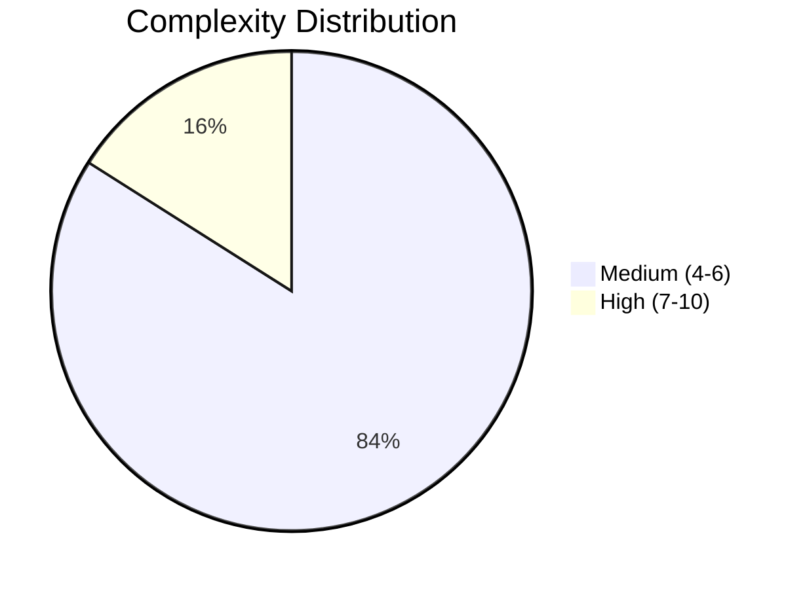
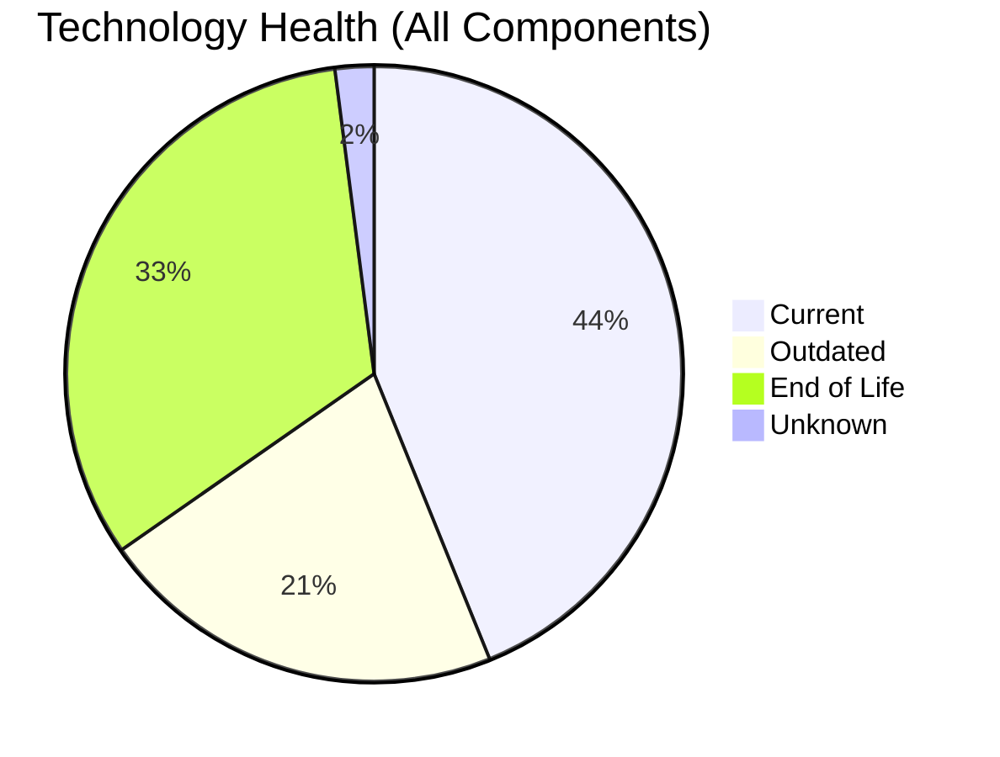
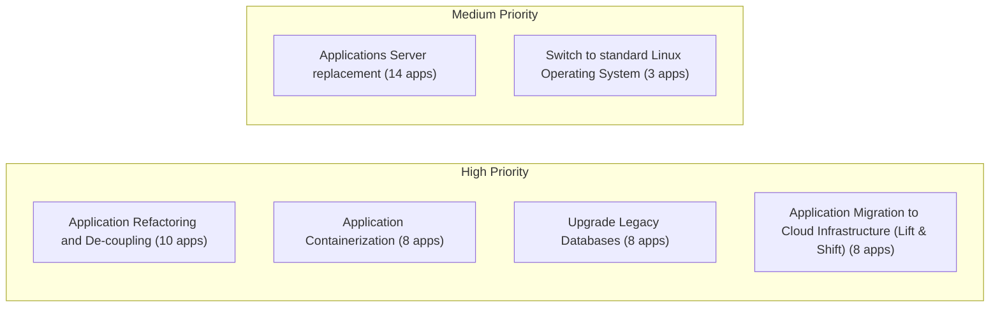
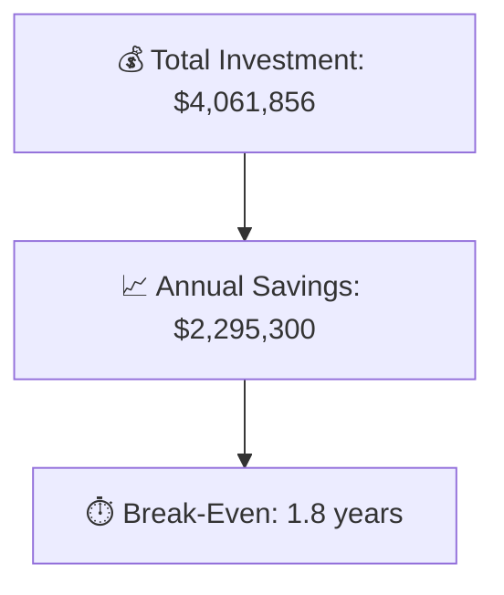

# Portfolio Modernization Report

**Generated:** 2026-05-14
**Applications Analyzed:** 25 (in-scope) out of 30 total

## Executive Summary

The portfolio of **25 active applications** was analyzed for modernization opportunities. The analysis identified **70 applicable modernization scenarios** across **23 applications**. Key risks include **32 EOL technology components** across the portfolio, with several applications running on deprecated operating systems (RHEL 7, CentOS 7, Debian 6/7, Windows Server 2012) and legacy languages (COBOL, Java 8, Ruby 2.7). The top modernization opportunities are OS updates, application containerization, legacy database upgrades, and cloud migration. The estimated total one-time investment is **$4,061,856** with expected annual savings of **$2,295,300**, yielding a portfolio break-even of **1.8 years**.

## Portfolio Overview

## Application Inventory

| # | App ID | App Name | Business Unit | Criticality | Complexity | Status |
|---|--------|----------|---------------|-------------|------------|--------|
| 1 | app001 | ERPApp-001 | Finance | High | 6/10 (MEDIUM) | In-Scope |
| 2 | app002 | CRMApp-002 | Marketing | Medium | 6/10 (MEDIUM) | In-Scope |
| 3 | app004 | HRApp-004 | HR | High | 6/10 (MEDIUM) | In-Scope |
| 4 | app006 | SupportApp-006 | IT | Medium | 5/10 (MEDIUM) | In-Scope |
| 5 | app008 | InventoryApp-008 | Operations | High | 7/10 (HIGH) | In-Scope |
| 6 | app010 | PayrollApp-010 | HR | Medium | 5/10 (MEDIUM) | In-Scope |
| 7 | app011 | RouteOptApp-011 | R&D | Medium | 5/10 (MEDIUM) | In-Scope |
| 8 | app012 | IoTSensorApp-012 | R&D | High | 4/10 (MEDIUM) | In-Scope |
| 9 | app013 | SecurityApp-013 | Security | Critical | 8/10 (HIGH) | In-Scope |
| 10 | app014 | DocumentApp-014 | Operations | Medium | 6/10 (MEDIUM) | In-Scope |
| 11 | app015 | ReportingApp-015 | Finance | Low | 4/10 (MEDIUM) | In-Scope |
| 12 | app016 | MobileApp-016 | Operations | Medium | 6/10 (MEDIUM) | In-Scope |
| 13 | app017 | BackupApp-017 | IT | High | 7/10 (HIGH) | In-Scope |
| 14 | app018 | VendorApp-018 | Procurement | Medium | 6/10 (MEDIUM) | In-Scope |
| 15 | app019 | QualityApp-019 | Quality | High | 6/10 (MEDIUM) | In-Scope |
| 16 | app020 | TrainingApp-020 | HR | Low | 6/10 (MEDIUM) | In-Scope |
| 17 | app021 | FleetApp-021 | Operations | High | 6/10 (MEDIUM) | In-Scope |
| 18 | app022 | ComplianceApp-022 | Compliance | Critical | 6/10 (MEDIUM) | In-Scope |
| 19 | app023 | ChatbotApp-023 | Customer Service | Medium | 5/10 (MEDIUM) | In-Scope |
| 20 | app024 | AuditApp-024 | Finance | High | 6/10 (MEDIUM) | In-Scope |
| 21 | app025 | PortalApp-025 | Operations | Medium | 5/10 (MEDIUM) | In-Scope |
| 22 | app026 | LegacyFinApp-026 | Finance | Critical | 6/10 (MEDIUM) | In-Scope |
| 23 | app027 | DataWarehouseApp-027 | BI | High | 7/10 (HIGH) | In-Scope |
| 24 | app028 | NotificationApp-028 | IT | Medium | 5/10 (MEDIUM) | In-Scope |
| 25 | app030 | APIGatewayApp-030 | IT | High | 6/10 (MEDIUM) | In-Scope |
| - | app003 | AnalyticsApp-003 | IT | Low | - | ⛔ Out of Scope |
| - | app005 | EComApp-005 | Operations | Critical | - | ⛔ Out of Scope |
| - | app007 | FinanceApp-007 | Finance | High | - | ⛔ Out of Scope |
| - | app009 | MarketingApp-009 | Marketing | Low | - | ⛔ Out of Scope |
| - | app029 | ConfigApp-029 | IT | Low | - | ⛔ Out of Scope |

## Top Modernization Opportunities

| Scenario | Apps | Priority | Total Cost | Annual Savings | ROI |
|----------|------|----------|-----------|----------------|-----|
| Application Refactoring and De-coupling | 10 | High | $2,755,972 | $1,335,000 | 2.1y |
| Application Containerization | 8 | High | $951,667 | $700,000 | 1.4y |
| Applications Server replacement | 14 | Medium | $166,321 | $146,400 | 1.1y |
| Upgrade Legacy Databases | 8 | High | $92,747 | $80,000 | 1.2y |
| Application Migration to Cloud Infrastructure (Lift & Shift) | 8 | High | $49,863 | $20,700 | 2.4y |
| Switch to ARM-based CPU | 5 | Medium | $27,405 | $5,000 | 5.5y |
| Operating System Update | 14 | High | $16,788 | $7,000 | 2.4y |
| Switch to standard Linux Operating System | 3 | Medium | $1,093 | $1,200 | 0.9y |

## Scenario Applicability Matrix

| Application | Operating Sy | Switch to st | Switch to AR | Applications | App Migratio | App Containe | App Refactor | Upgrade Lega | Switch DB En | Update outda |
|-------------|:---:|:---:|:---:|:---:|:---:|:---:|:---:|:---:|:---:|:---:|
| [ERPApp-001](apps/app001.md) | ✅ | ✅ | ❓ | ❌ | ✅ | 🚫 | ✅ | ✔️ | ✅ | ✅ |
| [CRMApp-002](apps/app002.md) | ✅ | ✔️ | ❌ | ✅ | ✔️ | 🚫 | ❓ | ✔️ | ✔️ | ✅ |
| [HRApp-004](apps/app004.md) | ✅ | ❌ | ❓ | ✅ | ⚠️ | ✔️ | ✅ | ✔️ | ✅ | ✅ |
| [SupportApp-006](apps/app006.md) | ✅ | ✔️ | ❌ | ✅ | ✔️ | 🚫 | ❓ | ✅ | ✔️ | ✅ |
| [InventoryApp-008](apps/app008.md) | ✅ | ✅ | ❓ | ✅ | ✅ | 🚫 | ✅ | ✔️ | ✅ | ✅ |
| [PayrollApp-010](apps/app010.md) | ✔️ | ❌ | ❌ | ❌ | ✔️ | 🚫 | ❓ | ✔️ | ✔️ | ✅ |
| [RouteOptApp-011](apps/app011.md) | ✅ | ✔️ | ✅ | ✅ | ✔️ | ✔️ | ❌ | ✔️ | ✔️ | ✅ |
| [IoTSensorApp-012](apps/app012.md) | ✔️ | ❌ | ❓ | ✔️ | ✔️ | ✔️ | ✅ | ✔️ | ✔️ | ✔️ |
| [SecurityApp-013](apps/app013.md) | ✅ | ✔️ | ❓ | ✅ | ✅ | ✅ | ❌ | ✔️ | ✅ | ✅ |
| [DocumentApp-014](apps/app014.md) | ✔️ | ❌ | ❓ | ✔️ | ✔️ | ✅ | ✅ | ✔️ | ✔️ | ✅ |
| [ReportingApp-015](apps/app015.md) | ✔️ | ❌ | ❓ | ✔️ | ✔️ | ✅ | ✅ | ❓ | ✔️ | ✅ |
| [MobileApp-016](apps/app016.md) | ✅ | ✔️ | ✅ | ✅ | ✔️ | ✔️ | ❌ | ✔️ | ✅ | ✅ |
| [BackupApp-017](apps/app017.md) | ✅ | ✔️ | ❌ | ✅ | ✅ | 🚫 | ❓ | ✅ | ✅ | ✅ |
| [VendorApp-018](apps/app018.md) | ✅ | ✔️ | ❓ | ✅ | ✅ | ✅ | ❌ | ✅ | ✔️ | ✅ |
| [QualityApp-019](apps/app019.md) | ✔️ | ✔️ | ❓ | ✅ | ⚠️ | ✅ | ❌ | ✔️ | ✔️ | ✅ |
| [TrainingApp-020](apps/app020.md) | ✅ | ❌ | ❌ | ✅ | ✔️ | 🚫 | 🚫 | ✅ | ✅ | ✅ |
| [FleetApp-021](apps/app021.md) | ✔️ | ❌ | ❓ | ✔️ | ✅ | ✅ | ✅ | ✅ | ✅ | ✅ |
| [ComplianceApp-022](apps/app022.md) | ✅ | ✔️ | ✅ | ✔️ | ⚠️ | ✔️ | ❌ | ✔️ | ✔️ | ✅ |
| [ChatbotApp-023](apps/app023.md) | ✔️ | ✔️ | ✅ | ✅ | ✔️ | ✔️ | ❌ | ❓ | ✔️ | ✅ |
| [AuditApp-024](apps/app024.md) | ✔️ | ❌ | ❓ | ✔️ | ✅ | ✅ | ✅ | ✅ | ✅ | ✅ |
| [PortalApp-025](apps/app025.md) | ✔️ | ❌ | ❓ | ✔️ | ✔️ | ✔️ | ✅ | ✔️ | ✔️ | ✅ |
| [LegacyFinApp-026](apps/app026.md) | ✅ | ✅ | ❓ | ❌ | ✅ | 🚫 | ✅ | ✅ | ✅ | ✅ |
| [DataWarehouseApp-027](apps/app027.md) | ✅ | ✔️ | ❓ | ✅ | ⚠️ | ✅ | ❌ | ✔️ | ✅ | ✅ |
| [NotificationApp-028](apps/app028.md) | ✔️ | ❌ | ❌ | ❌ | ✔️ | ✔️ | ❓ | ✔️ | ✅ | ✔️ |
| [APIGatewayApp-030](apps/app030.md) | ✔️ | ✔️ | ✅ | ✅ | ✔️ | ✔️ | ❌ | ✅ | ✔️ | ✅ |

Legend: ✅ Applicable | ✔️ Fulfilled | ❌ Not Applicable | 🚫 Blocked | ⚠️ Partially | ❓ Unknown

## Financial Summary

| Metric | Value |
|--------|-------|
| Applications In Scope | 25 |
| Applications with Opportunities | 23 |
| Total Applicable Scenarios | 70 |
| Total One-Time Investment | $4,061,856 |
| Total Annual Savings | $2,295,300 |
| Portfolio Break-Even | 1.8 years |

## High-Risk Applications

| Application | Complexity | EOL Components | Applicable Scenarios |
|-------------|-----------|----------------|---------------------|
| [SecurityApp-013](apps/app013.md) | 8/10 (HIGH) | 2 | 6 |
| [InventoryApp-008](apps/app008.md) | 7/10 (HIGH) | 2 | 7 |
| [BackupApp-017](apps/app017.md) | 7/10 (HIGH) | 2 | 6 |
| [DataWarehouseApp-027](apps/app027.md) | 7/10 (HIGH) | 1 | 5 |

## Per-Application Reports

| Application | Business Unit | Complexity | Report |
|-------------|---------------|------------|--------|
| ERPApp-001 | Finance | 6/10 (MEDIUM) | [View Report](apps/app001.md) |
| CRMApp-002 | Marketing | 6/10 (MEDIUM) | [View Report](apps/app002.md) |
| HRApp-004 | HR | 6/10 (MEDIUM) | [View Report](apps/app004.md) |
| SupportApp-006 | IT | 5/10 (MEDIUM) | [View Report](apps/app006.md) |
| InventoryApp-008 | Operations | 7/10 (HIGH) | [View Report](apps/app008.md) |
| PayrollApp-010 | HR | 5/10 (MEDIUM) | [View Report](apps/app010.md) |
| RouteOptApp-011 | R&D | 5/10 (MEDIUM) | [View Report](apps/app011.md) |
| IoTSensorApp-012 | R&D | 4/10 (MEDIUM) | [View Report](apps/app012.md) |
| SecurityApp-013 | Security | 8/10 (HIGH) | [View Report](apps/app013.md) |
| DocumentApp-014 | Operations | 6/10 (MEDIUM) | [View Report](apps/app014.md) |
| ReportingApp-015 | Finance | 4/10 (MEDIUM) | [View Report](apps/app015.md) |
| MobileApp-016 | Operations | 6/10 (MEDIUM) | [View Report](apps/app016.md) |
| BackupApp-017 | IT | 7/10 (HIGH) | [View Report](apps/app017.md) |
| VendorApp-018 | Procurement | 6/10 (MEDIUM) | [View Report](apps/app018.md) |
| QualityApp-019 | Quality | 6/10 (MEDIUM) | [View Report](apps/app019.md) |
| TrainingApp-020 | HR | 6/10 (MEDIUM) | [View Report](apps/app020.md) |
| FleetApp-021 | Operations | 6/10 (MEDIUM) | [View Report](apps/app021.md) |
| ComplianceApp-022 | Compliance | 6/10 (MEDIUM) | [View Report](apps/app022.md) |
| ChatbotApp-023 | Customer Service | 5/10 (MEDIUM) | [View Report](apps/app023.md) |
| AuditApp-024 | Finance | 6/10 (MEDIUM) | [View Report](apps/app024.md) |
| PortalApp-025 | Operations | 5/10 (MEDIUM) | [View Report](apps/app025.md) |
| LegacyFinApp-026 | Finance | 6/10 (MEDIUM) | [View Report](apps/app026.md) |
| DataWarehouseApp-027 | BI | 7/10 (HIGH) | [View Report](apps/app027.md) |
| NotificationApp-028 | IT | 5/10 (MEDIUM) | [View Report](apps/app028.md) |
| APIGatewayApp-030 | IT | 6/10 (MEDIUM) | [View Report](apps/app030.md) |
