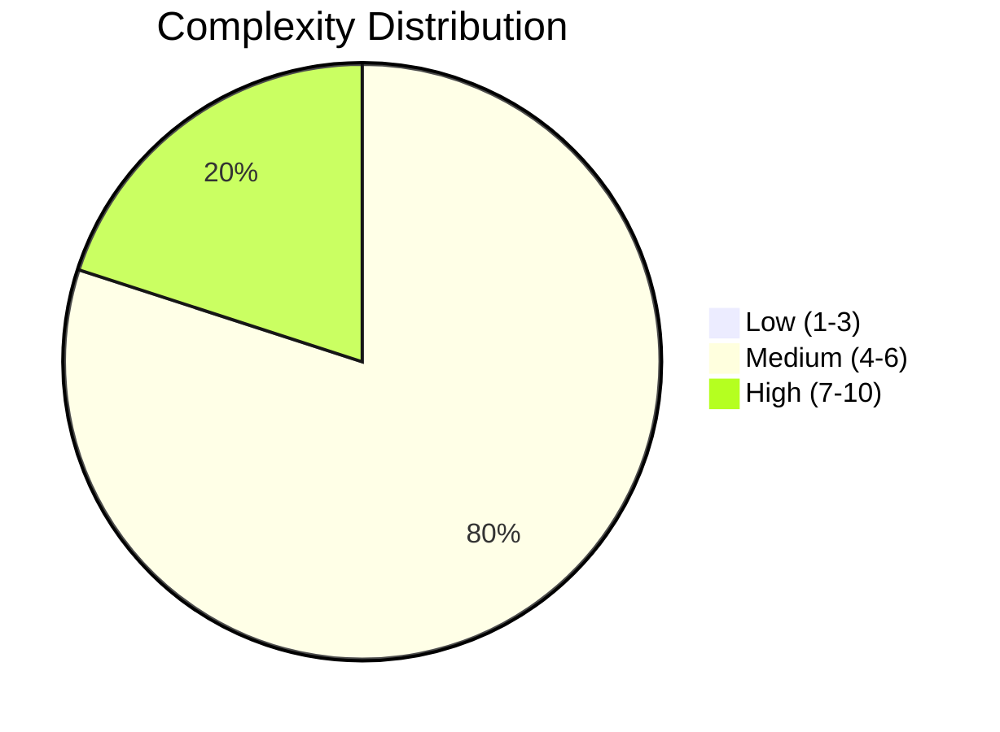
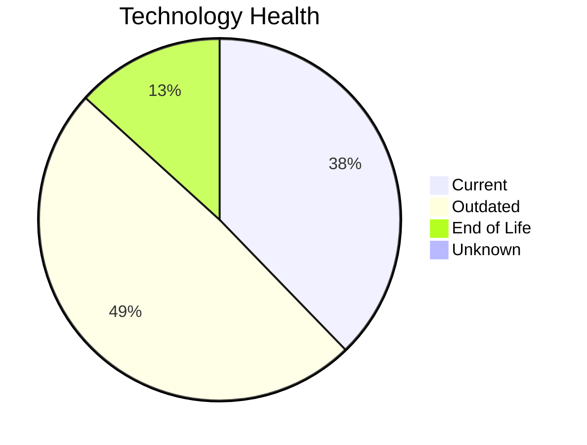
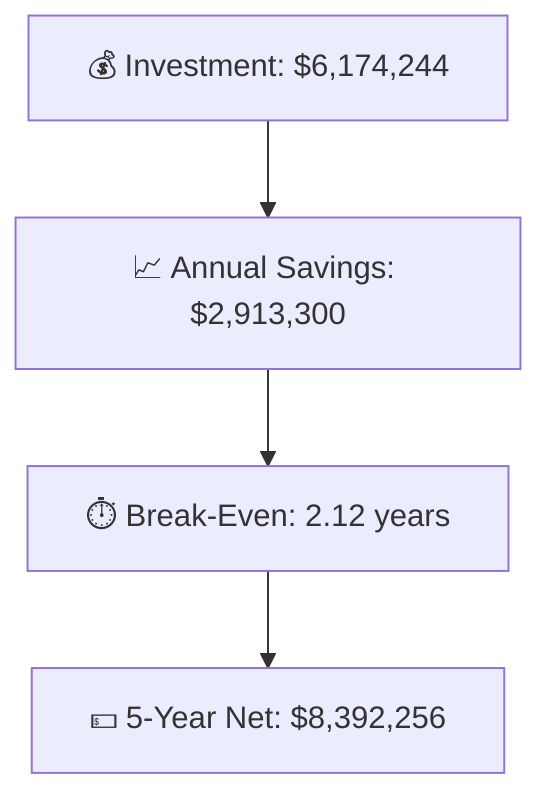

# Portfolio Modernization Report

**Generated:** 2026-05-07  
**Total Applications:** 30  
**In-Scope Applications:** 25  
**Out-of-Scope Applications:** 5

## Executive Summary

This portfolio contains 25 applications eligible for modernization analysis. The portfolio shows a total investment need of **$6,174,244.48** with projected annual savings of **$2,913,300.00**, yielding a break-even point of **2.12 years**.

Key findings:
- **5** applications are highly complex (complexity 7-10), requiring careful planning
- **13** technology components are end-of-life, presenting security and compliance risks
- **8** distinct modernization scenarios are applicable across the portfolio
- Top opportunity: **Update outdated components** applies to **25** applications

## Portfolio Overview

## Top Modernization Opportunities

| Scenario | Applicable Apps | Priority | Total Cost | Yearly Savings | ROI |
|----------|----------------|----------|------------|---------------|-----|
| Update outdated components | 25 | High | $0.00 | $0.00 | 0y |
| Application Refactoring and De-coupling | 20 | High | $5,823,099.05 | $2,625,000.00 | 2.22y |
| Applications Server replacement | 16 | Medium | $181,621.18 | $168,000.00 | 1.08y |
| Operating System Update | 12 | High | $13,946.25 | $6,000.00 | 2.32y |
| Switch to standard Linux Operating System | 9 | Medium | $2,999.56 | $3,600.00 | 0.83y |
| Upgrade Legacy Databases | 9 | High | $103,715.03 | $90,000.00 | 1.15y |
| Application Migration to Cloud Infrastructure (Lift & Shift) | 8 | High | $48,863.41 | $20,700.00 | 2.36y |
| Switch DB Engine to open-source database solution | 3 | High | $0.00 | $0.00 | 0y |

## Financial Summary

| Metric | Value |
|--------|-------|
| Total One-Time Investment | $6,174,244.48 |
| Total Annual Savings | $2,913,300.00 |
| Portfolio Break-Even | 2.12 years |
| Net Savings (Year 1) | $-3,260,944.48 |
| Net Savings (Year 3) | $2,565,655.52 |
| Net Savings (Year 5) | $8,392,255.52 |

## High-Risk Applications

Applications with the highest modernization complexity or most EOL components:

| Application | Complexity | EOL Components | Applicable Scenarios |
|-------------|-----------|---------------|---------------------|
| APIGatewayApp-030 | 8/10 | 2 | 3 |
| ERPApp-001 | 7/10 | 1 | 6 |
| SecurityApp-013 | 7/10 | 1 | 5 |
| BackupApp-017 | 7/10 | 0 | 6 |
| DataWarehouseApp-027 | 7/10 | 1 | 4 |
| InventoryApp-008 | 6/10 | 2 | 7 |

## Scenario Applicability Matrix

| Application | Update outdated comp | Application Refactor | Applications Server  | Operating System Upd | Switch to standard L |
|-------------|:---:|:---:|:---:|:---:|:---:|
| ERPApp-001 | ✅ | ✅ | ✅ | ✔️ | ✅ |
| CRMApp-002 | ✅ | ✅ | ✅ | ✅ | ✔️ |
| HRApp-004 | ✅ | ✅ | ✔️ | ✅ | ❌ |
| SupportApp-006 | ✅ | ❌ | ✅ | ✅ | ✔️ |
| InventoryApp-008 | ✅ | ✅ | ✅ | ✅ | ✅ |
| PayrollApp-010 | ✅ | ❌ | ✅ | ✔️ | ✅ |
| RouteOptApp-011 | ✅ | ✅ | ✔️ | ✅ | ✔️ |
| IoTSensorApp-012 | ✅ | ✅ | ✔️ | ✔️ | ❌ |
| SecurityApp-013 | ✅ | ✅ | ✅ | ✅ | ✔️ |
| DocumentApp-014 | ✅ | ✅ | ✅ | ✔️ | ✅ |

**Legend:** ✅ Applicable | ❌ Not Applicable | ✔️ Already Fulfilled | 🚫 Blocked | ❓ Insufficient Data

## Per-Application Reports

Detailed reports for each application are available in `output/reports/apps/`:

- [ERPApp-001](apps/app001.md)
- [CRMApp-002](apps/app002.md)
- [HRApp-004](apps/app004.md)
- [SupportApp-006](apps/app006.md)
- [InventoryApp-008](apps/app008.md)
- [PayrollApp-010](apps/app010.md)
- [RouteOptApp-011](apps/app011.md)
- [IoTSensorApp-012](apps/app012.md)
- [SecurityApp-013](apps/app013.md)
- [DocumentApp-014](apps/app014.md)
- [ReportingApp-015](apps/app015.md)
- [MobileApp-016](apps/app016.md)
- [BackupApp-017](apps/app017.md)
- [VendorApp-018](apps/app018.md)
- [QualityApp-019](apps/app019.md)
- [TrainingApp-020](apps/app020.md)
- [FleetApp-021](apps/app021.md)
- [ComplianceApp-022](apps/app022.md)
- [ChatbotApp-023](apps/app023.md)
- [AuditApp-024](apps/app024.md)
- [PortalApp-025](apps/app025.md)
- [LegacyFinApp-026](apps/app026.md)
- [DataWarehouseApp-027](apps/app027.md)
- [NotificationApp-028](apps/app028.md)
- [APIGatewayApp-030](apps/app030.md)

---

*This report was automatically generated from application portfolio analysis.*
