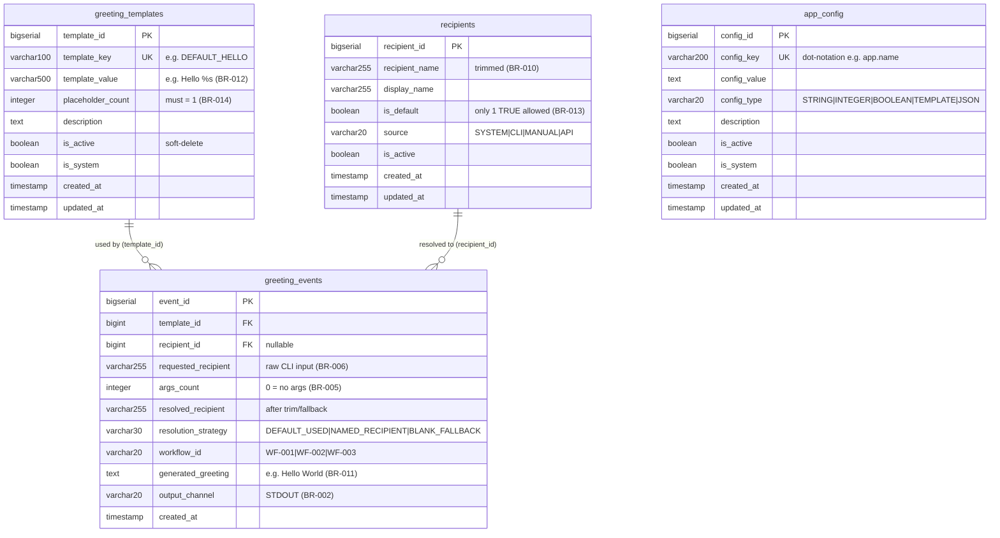
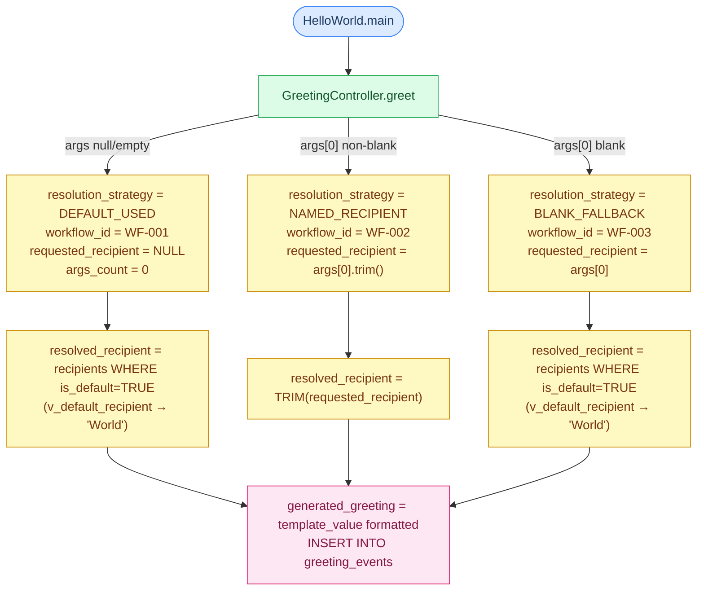

# LegacyFinApp-026 — Database Schema Documentation

**Project**: `copilot-test-ktruchcz` · **Application**: `com.example:hello-world:1.0.0`  
**Domain**: Greeting Generation · **Dialect**: PostgreSQL 15+  
**Generated by**: `ddl-generator` agent · **Date**: 2025-01-01

> **File location note**: The DDL was requested at `output/database_schema.sql`.  
> The `output/` directory did not exist at generation time; the SQL was saved to  
> `database_schema.sql` (workspace root) — same pattern used by `ast-analyzer`.

---

## Table of Contents

1. [Schema Overview](#1-schema-overview)
2. [Entity-Relationship Diagram](#2-entity-relationship-diagram)
3. [Table Reference](#3-table-reference)
   - 3.1 [greeting_templates](#31-greeting_templates)
   - 3.2 [recipients](#32-recipients)
   - 3.3 [greeting_events](#33-greeting_events)
   - 3.4 [app_config](#34-app_config)
4. [Views](#4-views)
5. [Indexes Summary](#5-indexes-summary)
6. [Seed Data](#6-seed-data)
7. [Business Rule Traceability](#7-business-rule-traceability)
8. [Workflow → Schema Mapping](#8-workflow--schema-mapping)
9. [Design Decisions](#9-design-decisions)
10. [Complete DDL Script Reference](#10-complete-ddl-script-reference)

---

## 1. Schema Overview

The schema externalises the two hard-coded values currently returned by
`GreetingRepository` and extends them with full lifecycle tracking:

| Metric | Value |
|---|---|
| **Total Tables** | 4 |
| **Total Columns** | 43 |
| **Total Indexes** | 17 |
| **Foreign Keys** | 2 |
| **CHECK Constraints** | 11 |
| **UNIQUE Constraints** | 3 |
| **Triggers** | 3 |
| **Views** | 4 |
| **Seed Rows** | 15 |

### Domain Entities

| Table | Java Source | Current Hard-coded Value | Purpose |
|---|---|---|---|
| `greeting_templates` | `GreetingRepository.getGreetingTemplate()` | `"Hello %s"` | Configurable message format strings |
| `recipients` | `GreetingRepository.getDefaultRecipient()` | `"World"` | Named greeting targets + default |
| `greeting_events` | `GreetingService.createGreeting()` output | _none_ | Immutable audit log of every greeting |
| `app_config` | `HelloWorld.main()` + implicit config | _none_ | Key/value application settings |

---

## 2. Entity-Relationship Diagram



---

## 3. Table Reference

### 3.1 `greeting_templates`

**Purpose**: Stores configurable Java `String.format()`-compatible message templates.
Backs `GreetingRepository.getGreetingTemplate()`.

**Business rules**: BR-012 (default = `Hello %s`), BR-014 (exactly one `%s` placeholder)

| Column | Type | Nullable | Default | Description |
|---|---|---|---|---|
| `template_id` | `BIGSERIAL` | NO | auto | Surrogate PK |
| `template_key` | `VARCHAR(100)` | NO | — | Unique logical key (e.g. `DEFAULT_HELLO`) |
| `template_value` | `VARCHAR(500)` | NO | — | Format string, must contain `%s` |
| `placeholder_count` | `INTEGER` | NO | `1` | Count of `%s` occurrences; must equal 1 |
| `description` | `TEXT` | YES | — | Human-readable purpose |
| `is_active` | `BOOLEAN` | NO | `TRUE` | Soft-delete flag |
| `is_system` | `BOOLEAN` | NO | `FALSE` | Protected system row flag |
| `created_at` | `TIMESTAMP` | NO | `NOW()` | Insert timestamp |
| `updated_at` | `TIMESTAMP` | NO | `NOW()` | Last update timestamp (trigger-maintained) |

**Constraints**:

| Name | Type | Expression |
|---|---|---|
| `chk_greeting_templates_placeholder_count` | CHECK | `placeholder_count = 1` |
| `chk_greeting_templates_value_has_placeholder` | CHECK | `template_value LIKE '%' \|\| '%s' \|\| '%'` |
| `uq_greeting_templates_key` | UNIQUE | `(template_key)` |

```sql
CREATE TABLE greeting_templates (
    template_id       BIGSERIAL         PRIMARY KEY,
    template_key      VARCHAR(100)      NOT NULL,
    template_value    VARCHAR(500)      NOT NULL,
    placeholder_count INTEGER           NOT NULL DEFAULT 1,
    description       TEXT,
    is_active         BOOLEAN           NOT NULL DEFAULT TRUE,
    is_system         BOOLEAN           NOT NULL DEFAULT FALSE,
    created_at        TIMESTAMP         NOT NULL DEFAULT CURRENT_TIMESTAMP,
    updated_at        TIMESTAMP         NOT NULL DEFAULT CURRENT_TIMESTAMP,
    CONSTRAINT chk_greeting_templates_placeholder_count
        CHECK (placeholder_count = 1),
    CONSTRAINT chk_greeting_templates_value_has_placeholder
        CHECK (template_value LIKE '%' || '%s' || '%'),
    CONSTRAINT uq_greeting_templates_key
        UNIQUE (template_key)
);
```

---

### 3.2 `recipients`

**Purpose**: Catalogue of named greeting targets. Backs `GreetingRepository.getDefaultRecipient()`.

**Business rules**: BR-008 & BR-009 (null/blank → default), BR-010 (trimmed names),
BR-013 (`World` is default). Default enforced by partial unique index.

| Column | Type | Nullable | Default | Description |
|---|---|---|---|---|
| `recipient_id` | `BIGSERIAL` | NO | auto | Surrogate PK |
| `recipient_name` | `VARCHAR(255)` | NO | — | Trimmed name (BR-010) |
| `display_name` | `VARCHAR(255)` | YES | — | Optional display override |
| `is_default` | `BOOLEAN` | NO | `FALSE` | Only one row may be TRUE (BR-013) |
| `source` | `VARCHAR(20)` | NO | `'MANUAL'` | `SYSTEM`/`CLI`/`MANUAL`/`API` |
| `is_active` | `BOOLEAN` | NO | `TRUE` | Soft-delete flag |
| `created_at` | `TIMESTAMP` | NO | `NOW()` | Insert timestamp |
| `updated_at` | `TIMESTAMP` | NO | `NOW()` | Last update timestamp (trigger-maintained) |

**Constraints**:

| Name | Type | Expression |
|---|---|---|
| `chk_recipients_name_not_blank` | CHECK | `TRIM(recipient_name) <> ''` |
| `chk_recipients_source` | CHECK | `source IN ('SYSTEM', 'CLI', 'MANUAL', 'API')` |
| `uq_recipients_single_default` | UNIQUE (partial) | `(is_default) WHERE is_default = TRUE` |

```sql
CREATE TABLE recipients (
    recipient_id      BIGSERIAL         PRIMARY KEY,
    recipient_name    VARCHAR(255)      NOT NULL,
    display_name      VARCHAR(255),
    is_default        BOOLEAN           NOT NULL DEFAULT FALSE,
    source            VARCHAR(20)       NOT NULL DEFAULT 'MANUAL',
    is_active         BOOLEAN           NOT NULL DEFAULT TRUE,
    created_at        TIMESTAMP         NOT NULL DEFAULT CURRENT_TIMESTAMP,
    updated_at        TIMESTAMP         NOT NULL DEFAULT CURRENT_TIMESTAMP,
    CONSTRAINT chk_recipients_name_not_blank
        CHECK (TRIM(recipient_name) <> ''),
    CONSTRAINT chk_recipients_source
        CHECK (source IN ('SYSTEM', 'CLI', 'MANUAL', 'API'))
);

-- Only ONE row may ever have is_default = TRUE (BR-013)
CREATE UNIQUE INDEX uq_recipients_single_default
    ON recipients (is_default) WHERE is_default = TRUE;
```

---

### 3.3 `greeting_events`

**Purpose**: Immutable audit log of every greeting produced. Rows are INSERT-only.
Captures input → resolution → output for all three workflows.

**Business rules**: BR-001, BR-002, BR-004, BR-005, BR-006, BR-008, BR-009, BR-010, BR-011

| Column | Type | Nullable | Default | Description |
|---|---|---|---|---|
| `event_id` | `BIGSERIAL` | NO | auto | Surrogate PK |
| `template_id` | `BIGINT` | NO | — | FK → `greeting_templates` |
| `recipient_id` | `BIGINT` | YES | — | FK → `recipients` (NULL if ad-hoc) |
| `requested_recipient` | `VARCHAR(255)` | YES | — | Raw CLI `args[0]` (NULL if no args) |
| `args_count` | `INTEGER` | NO | `0` | Number of CLI args (0 = none) |
| `resolved_recipient` | `VARCHAR(255)` | NO | — | Final name after trim/fallback |
| `resolution_strategy` | `VARCHAR(30)` | NO | — | `DEFAULT_USED` / `NAMED_RECIPIENT` / `BLANK_FALLBACK` |
| `workflow_id` | `VARCHAR(20)` | YES | — | `WF-001` / `WF-002` / `WF-003` |
| `generated_greeting` | `TEXT` | NO | — | Complete output, e.g. `Hello World` |
| `output_channel` | `VARCHAR(20)` | NO | `'STDOUT'` | Destination channel |
| `created_at` | `TIMESTAMP` | NO | `NOW()` | Immutable insert timestamp |

**Constraints**:

| Name | Type | Expression |
|---|---|---|
| `fk_greeting_events_template` | FK | `template_id → greeting_templates(template_id) ON DELETE RESTRICT` |
| `fk_greeting_events_recipient` | FK | `recipient_id → recipients(recipient_id) ON DELETE SET NULL` |
| `chk_greeting_events_resolution_strategy` | CHECK | `resolution_strategy IN (...)` |
| `chk_greeting_events_output_channel` | CHECK | `output_channel IN (...)` |
| `chk_greeting_events_args_count` | CHECK | `args_count >= 0` |
| `chk_greeting_events_resolved_recipient_not_blank` | CHECK | `TRIM(resolved_recipient) <> ''` |
| `chk_greeting_events_blank_fallback_consistency` | CHECK | BLANK_FALLBACK ↔ blank requested_recipient |

```sql
CREATE TABLE greeting_events (
    event_id             BIGSERIAL       PRIMARY KEY,
    template_id          BIGINT          NOT NULL,
    recipient_id         BIGINT,
    requested_recipient  VARCHAR(255),
    args_count           INTEGER         NOT NULL DEFAULT 0,
    resolved_recipient   VARCHAR(255)    NOT NULL,
    resolution_strategy  VARCHAR(30)     NOT NULL,
    workflow_id          VARCHAR(20),
    generated_greeting   TEXT            NOT NULL,
    output_channel       VARCHAR(20)     NOT NULL DEFAULT 'STDOUT',
    created_at           TIMESTAMP       NOT NULL DEFAULT CURRENT_TIMESTAMP,
    CONSTRAINT fk_greeting_events_template
        FOREIGN KEY (template_id) REFERENCES greeting_templates(template_id)
        ON DELETE RESTRICT,
    CONSTRAINT fk_greeting_events_recipient
        FOREIGN KEY (recipient_id) REFERENCES recipients(recipient_id)
        ON DELETE SET NULL,
    CONSTRAINT chk_greeting_events_resolution_strategy
        CHECK (resolution_strategy IN ('DEFAULT_USED', 'NAMED_RECIPIENT', 'BLANK_FALLBACK')),
    CONSTRAINT chk_greeting_events_output_channel
        CHECK (output_channel IN ('STDOUT', 'STDERR', 'FILE', 'DATABASE', 'API')),
    CONSTRAINT chk_greeting_events_args_count
        CHECK (args_count >= 0),
    CONSTRAINT chk_greeting_events_resolved_recipient_not_blank
        CHECK (TRIM(resolved_recipient) <> ''),
    CONSTRAINT chk_greeting_events_blank_fallback_consistency
        CHECK (resolution_strategy <> 'BLANK_FALLBACK'
               OR (requested_recipient IS NOT NULL AND TRIM(requested_recipient) = ''))
);
```

---

### 3.4 `app_config`

**Purpose**: Key/value store for application settings currently implicit in Java source.

| Column | Type | Nullable | Default | Description |
|---|---|---|---|---|
| `config_id` | `BIGSERIAL` | NO | auto | Surrogate PK |
| `config_key` | `VARCHAR(200)` | NO | — | Unique dot-notation key |
| `config_value` | `TEXT` | YES | — | Value as string |
| `config_type` | `VARCHAR(20)` | NO | `'STRING'` | `STRING`/`INTEGER`/`BOOLEAN`/`TEMPLATE`/`JSON` |
| `description` | `TEXT` | YES | — | Human-readable explanation |
| `is_active` | `BOOLEAN` | NO | `TRUE` | Soft-delete flag |
| `is_system` | `BOOLEAN` | NO | `FALSE` | Protected system row flag |
| `created_at` | `TIMESTAMP` | NO | `NOW()` | Insert timestamp |
| `updated_at` | `TIMESTAMP` | NO | `NOW()` | Last update (trigger-maintained) |

**Constraints**: `uq_app_config_key` (UNIQUE on `config_key`), `chk_app_config_type` (enum CHECK)

```sql
CREATE TABLE app_config (
    config_id     BIGSERIAL     PRIMARY KEY,
    config_key    VARCHAR(200)  NOT NULL,
    config_value  TEXT,
    config_type   VARCHAR(20)   NOT NULL DEFAULT 'STRING',
    description   TEXT,
    is_active     BOOLEAN       NOT NULL DEFAULT TRUE,
    is_system     BOOLEAN       NOT NULL DEFAULT FALSE,
    created_at    TIMESTAMP     NOT NULL DEFAULT CURRENT_TIMESTAMP,
    updated_at    TIMESTAMP     NOT NULL DEFAULT CURRENT_TIMESTAMP,
    CONSTRAINT uq_app_config_key  UNIQUE (config_key),
    CONSTRAINT chk_app_config_type
        CHECK (config_type IN ('STRING', 'INTEGER', 'BOOLEAN', 'TEMPLATE', 'JSON'))
);
```

---

## 4. Views

| View | Purpose | Key Filter |
|---|---|---|
| `v_active_greeting_templates` | Active templates available for GreetingService | `is_active = TRUE` |
| `v_default_recipient` | Current default recipient (BR-013) | `is_default = TRUE AND is_active = TRUE` |
| `v_greeting_event_summary` | Denormalised events + template + recipient | — (LEFT JOIN) |
| `v_workflow_statistics` | Aggregated counts per resolution strategy | GROUP BY strategy + workflow |

```sql
-- Quick lookup of default recipient (BR-008, BR-009, BR-013)
SELECT * FROM v_default_recipient;
-- Returns: recipient_id=1, recipient_name='World', display_name='World', source='SYSTEM'

-- Analytics: which workflow fires most often?
SELECT * FROM v_workflow_statistics;
-- Returns: resolution_strategy, workflow_id, event_count, first_event_at, last_event_at, percentage
```

---

## 5. Indexes Summary

| Index Name | Table | Columns | Type | Rationale |
|---|---|---|---|---|
| `idx_greeting_templates_key` | `greeting_templates` | `template_key` | B-Tree | Primary lookup by key |
| `idx_greeting_templates_active` | `greeting_templates` | `is_active` | B-Tree | Filter inactive templates |
| `idx_greeting_templates_key_active` | `greeting_templates` | `(template_key, is_active)` | Partial | Active-only template fetch in single scan |
| `idx_recipients_name` | `recipients` | `recipient_name` | B-Tree | Lookup by name (GreetingService) |
| `idx_recipients_is_default` | `recipients` | `is_default` | B-Tree | Default recipient lookup |
| `idx_recipients_active` | `recipients` | `is_active` | B-Tree | Filter inactive recipients |
| `idx_recipients_default_active` | `recipients` | `(is_default, is_active)` | Partial | Combined default+active scan |
| `idx_recipients_name_lower` | `recipients` | `LOWER(recipient_name)` | B-Tree | Case-insensitive CLI matching |
| `uq_recipients_single_default` | `recipients` | `is_default` | Partial Unique | Enforce single default (BR-013) |
| `idx_greeting_events_template_id` | `greeting_events` | `template_id` | B-Tree | FK join performance |
| `idx_greeting_events_recipient_id` | `greeting_events` | `recipient_id` | B-Tree | FK join performance |
| `idx_greeting_events_created_at` | `greeting_events` | `created_at DESC` | B-Tree | Time-series queries |
| `idx_greeting_events_strategy` | `greeting_events` | `resolution_strategy` | B-Tree | Analytics by resolution type |
| `idx_greeting_events_workflow` | `greeting_events` | `workflow_id` | B-Tree | Analytics by workflow |
| `idx_greeting_events_template_time` | `greeting_events` | `(template_id, created_at DESC)` | Composite | Events per template over time |
| `idx_greeting_events_recipient_time` | `greeting_events` | `(recipient_id, created_at DESC)` | Partial composite | Events per known recipient |
| `idx_app_config_key` | `app_config` | `config_key` | B-Tree | Key lookup (backed by UNIQUE) |
| `idx_app_config_active` | `app_config` | `is_active` | B-Tree | Filter inactive configs |
| `idx_app_config_type` | `app_config` | `config_type` | B-Tree | Group by type |

---

## 6. Seed Data

### greeting_templates (4 rows)

| template_key | template_value | is_active | is_system | Source BR |
|---|---|---|---|---|
| `DEFAULT_HELLO` | `Hello %s` | ✅ TRUE | ✅ TRUE | BR-012 |
| `INFORMAL_HI` | `Hi %s` | ❌ FALSE | ❌ FALSE | extensibility |
| `FORMAL_DEAR` | `Dear %s` | ❌ FALSE | ❌ FALSE | extensibility |
| `FAREWELL` | `Goodbye %s` | ❌ FALSE | ❌ FALSE | extensibility |

### recipients (2 rows)

| recipient_name | display_name | is_default | source | Source BR |
|---|---|---|---|---|
| `World` | `World` | ✅ TRUE | `SYSTEM` | BR-013 |
| `Copilot` | `GitHub Copilot` | ❌ FALSE | `SYSTEM` | Test coverage |

### app_config (8 rows)

| config_key | config_value | config_type | Source |
|---|---|---|---|
| `app.name` | `LegacyFinApp-026` | STRING | `pom.xml` |
| `app.version` | `1.0.0` | STRING | `pom.xml` |
| `app.group_id` | `com.example` | STRING | `pom.xml` |
| `greeting.template.active_key` | `DEFAULT_HELLO` | STRING | BR-012 |
| `greeting.default.output_channel` | `STDOUT` | STRING | BR-002 |
| `greeting.recipient.trim_enabled` | `true` | BOOLEAN | BR-010 |
| `greeting.recipient.fallback_on_blank` | `true` | BOOLEAN | BR-009 |
| `greeting.args.use_first_only` | `true` | BOOLEAN | BR-006 |

### greeting_events (1 row — canonical seed)

| requested_recipient | args_count | resolved_recipient | resolution_strategy | workflow_id | generated_greeting |
|---|---|---|---|---|---|
| `NULL` | `0` | `World` | `DEFAULT_USED` | `WF-001` | `Hello World` |

---

## 7. Business Rule Traceability

| Rule ID | Rule Summary | Schema Element |
|---|---|---|
| **BR-001** | No args → use default recipient | `resolution_strategy = 'DEFAULT_USED'`, `args_count = 0` seed |
| **BR-002** | Output to stdout | `output_channel DEFAULT 'STDOUT'`, CHECK `IN ('STDOUT', ...)` |
| **BR-004** | Null args → null forwarded to service | `requested_recipient` NULLABLE column |
| **BR-005** | Empty args → treat as absent | `args_count = 0` seed row, `CHECK args_count >= 0` |
| **BR-006** | Only `args[0]` used | Single `requested_recipient` column; `args_count` records total |
| **BR-008** | Null recipient → default fallback | `resolution_strategy = 'DEFAULT_USED'`, `v_default_recipient` view |
| **BR-009** | Blank recipient → default fallback | `resolution_strategy = 'BLANK_FALLBACK'`, consistency CHECK |
| **BR-010** | Non-blank trimmed before use | `chk_recipients_name_not_blank`, column comment |
| **BR-011** | Greeting = template formatted with recipient | `generated_greeting NOT NULL`, FK to template |
| **BR-012** | Template = `Hello %s` | Seed row `DEFAULT_HELLO`, `chk_value_has_placeholder` |
| **BR-013** | Default recipient = `World` | Seed row `World` with `is_default=TRUE`, `uq_recipients_single_default` |
| **BR-014** | Exactly one `%s` in template | `chk_placeholder_count = 1`, `chk_value_has_placeholder` |

> **BR-003** (null GreetingService → NPE) and **BR-007** (null GreetingRepository → NPE)  
> are application-layer guards enforced by `Objects.requireNonNull()` in Java;  
> no direct schema representation is required.

---

## 8. Workflow → Schema Mapping



---

## 9. Design Decisions

### 1 — `greeting_events` is INSERT-only (no `updated_at`)
The audit log must be immutable to maintain a trustworthy record.  Once a greeting
has been produced, that fact cannot change.  The absence of `updated_at` signals
this intent to all maintainers.

### 2 — Single-default enforcement via partial unique index
```sql
CREATE UNIQUE INDEX uq_recipients_single_default
    ON recipients (is_default) WHERE is_default = TRUE;
```
A partial unique index on `(is_default) WHERE is_default = TRUE` is the idiomatic
PostgreSQL way to enforce "at most one TRUE" without triggers or application-layer checks.
This directly encodes BR-013.

### 3 — `recipient_id` is nullable in `greeting_events`
CLI input can contain arbitrary strings that may not exist in the `recipients` catalogue.
Using `ON DELETE SET NULL` means that if a recipient catalogue entry is later removed,
historical event rows are preserved with `recipient_id = NULL` (a deliberate orphan).

### 4 — `ON DELETE RESTRICT` for templates
Templates that have produced events must never be deleted silently.  `RESTRICT` forces
operators to explicitly deal with history before removing a template.

### 5 — `placeholder_count` stored alongside `template_value`
While the count is derivable from the string, storing it as a column enables the simple
`CHECK (placeholder_count = 1)` without requiring a regex or PL/pgSQL in the constraint.
The application is responsible for keeping `placeholder_count` consistent with `template_value`.

### 6 — `source` column on `recipients`
Tracks the provenance of each recipient entry.  `SYSTEM` = schema seed (`World`, `Copilot`);
`CLI` = discovered from command-line usage; `MANUAL` = operator-entered; `API` = future.

---

## 10. Complete DDL Script Reference

The complete SQL DDL script (including all table definitions, constraints, indexes,
triggers, views, and seed data) is at:

**`database_schema.sql`** (workspace root — `output/` directory was unavailable)

The script is self-contained and idempotent for extensions; tables and views use
`CREATE TABLE` / `CREATE OR REPLACE VIEW`.  Run against a fresh PostgreSQL 15+ database:

```bash
psql -U postgres -d legacyfinapp026 -f database_schema.sql
```

---

*Generated by `ddl-generator` agent from static analysis of LegacyFinApp-026.*  
*Sources: `analysis_results.json`, `business_rules_extractor_analysis.json`, `ast_analysis.json`*
