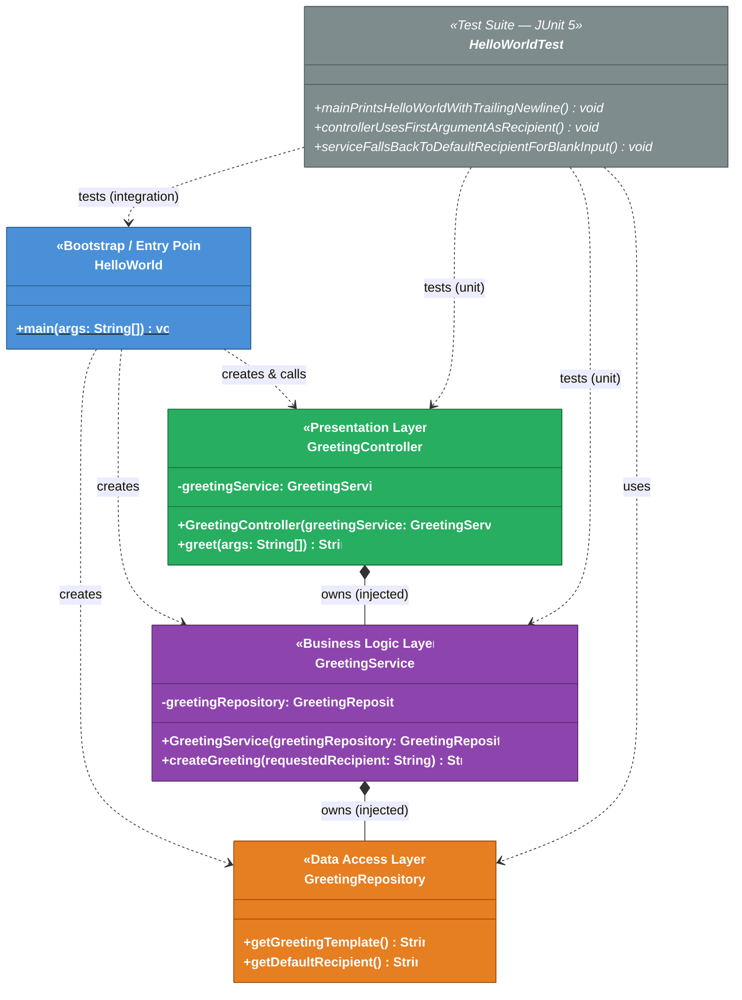
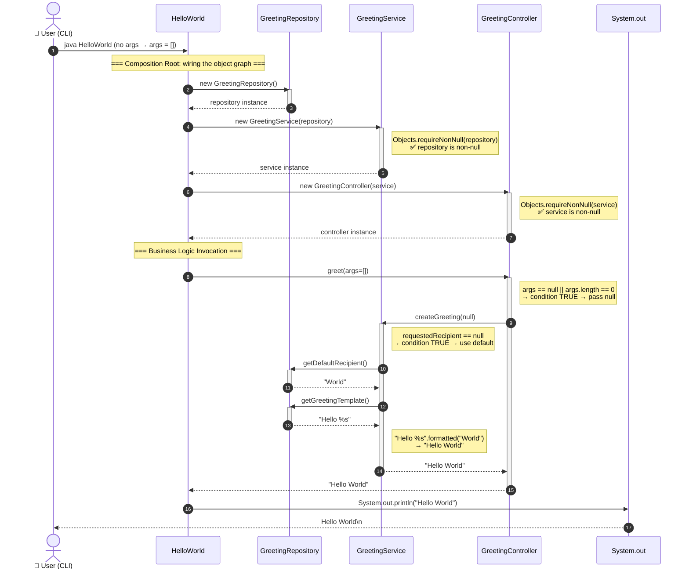
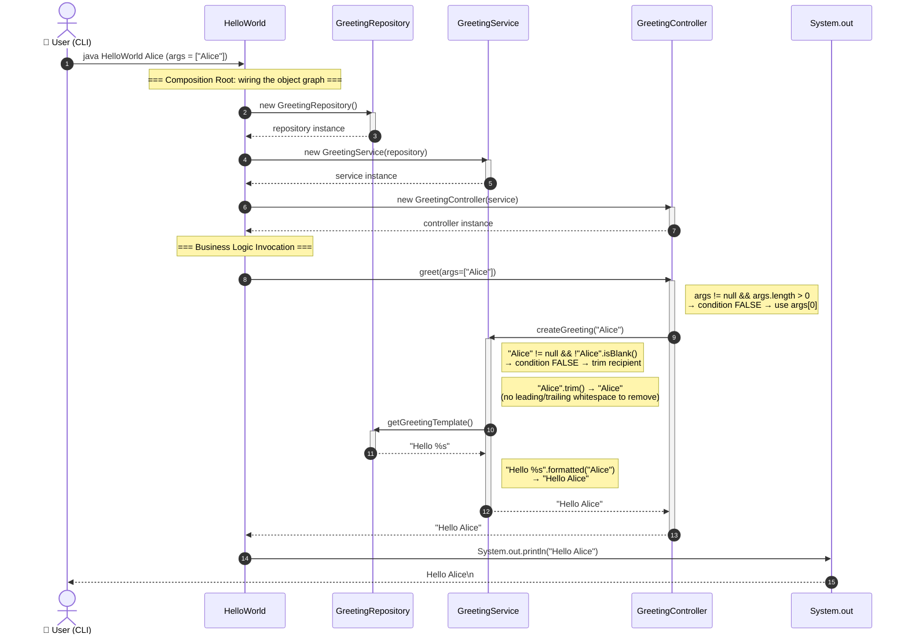
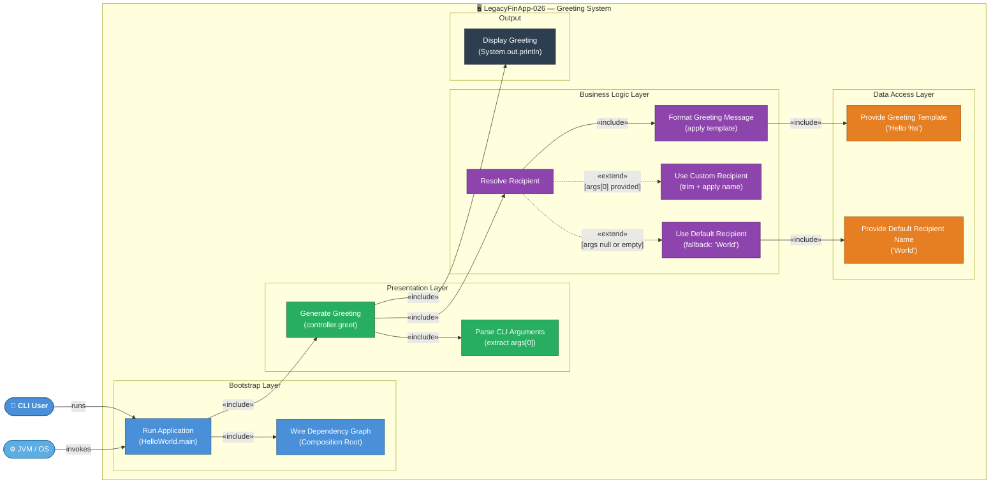
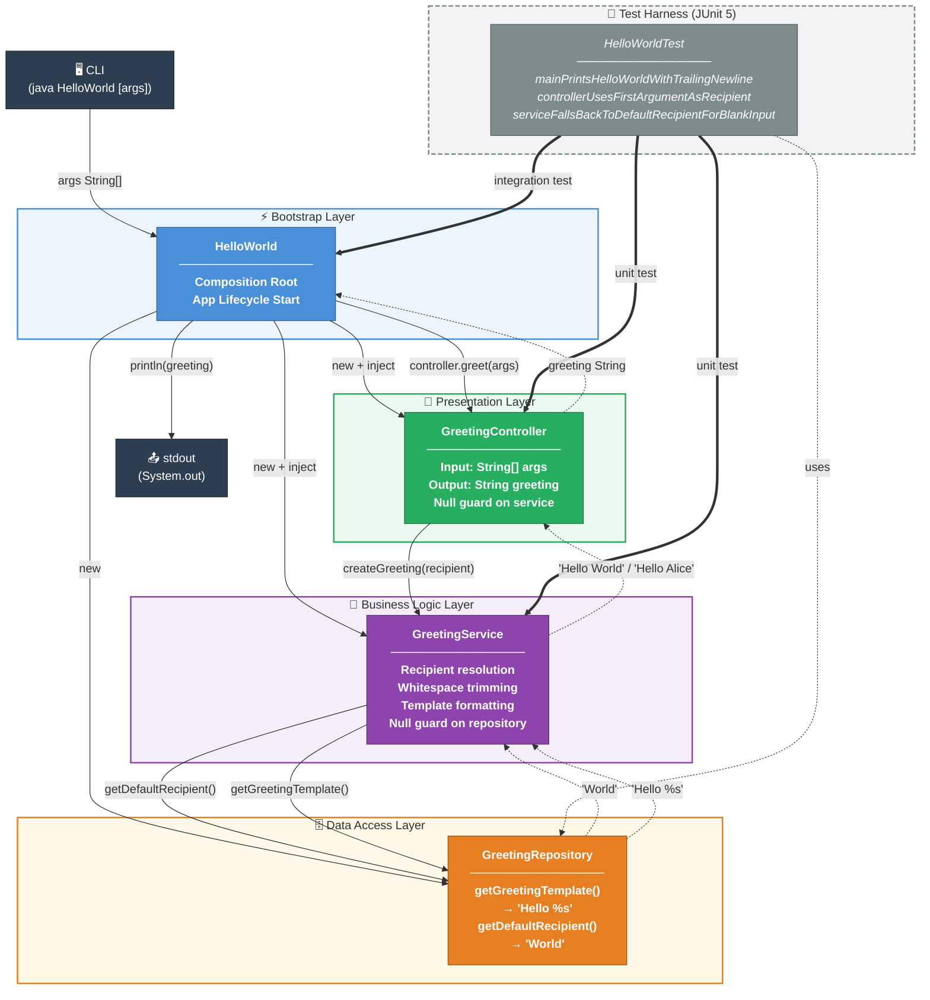
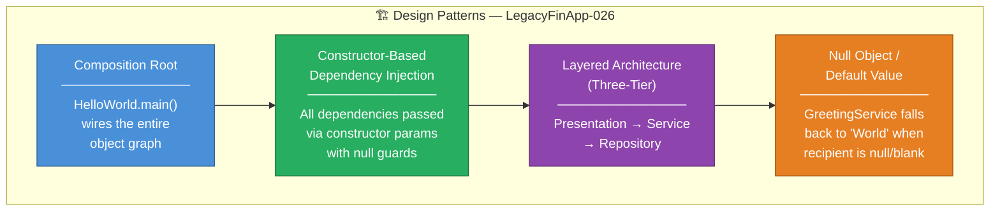

# UML Diagrams — LegacyFinApp-026 (Hello World)

> **Project:** LegacyFinApp-026 · **Language:** Java 25 · **Build:** Maven  
> **Architecture:** Three-tier layered architecture with constructor-based dependency injection  
> **Generated by:** uml-generator agent  
> **Source inputs:** `analysis_results.json`, `ast_analysis.json`, `business_rules_extractor_analysis.json`  
> **Note:** Target directory `/output/` did not exist; file saved to workspace root instead.

---

## Table of Contents

1. [Class Diagram](#1-class-diagram)
2. [Sequence Diagram — Default Greeting Flow (no args)](#2-sequence-diagram--default-greeting-flow-no-args)
3. [Sequence Diagram — Named Recipient Flow (with args)](#3-sequence-diagram--named-recipient-flow-with-args)
4. [Use Case Diagram](#4-use-case-diagram)
5. [Component Diagram](#5-component-diagram)

---

## 1. Class Diagram

Shows all five classes, their fields, methods, visibility modifiers, and the full relationship graph including composition, dependency, and test associations.



### Class Summary

| Class | Layer | Responsibility |
|---|---|---|
| `HelloWorld` | Bootstrap | Composition root — wires all layers and triggers execution |
| `GreetingController` | Presentation | Parses CLI `args[]`, extracts recipient, delegates to service |
| `GreetingService` | Business Logic | Resolves recipient (null/blank fallback + trim), formats greeting |
| `GreetingRepository` | Data Access | Provides static config: template `"Hello %s"` and default `"World"` |
| `HelloWorldTest` | Test | JUnit 5 suite — 3 tests covering integration + unit paths |

### Key Relationships

| From | To | Type | Detail |
|---|---|---|---|
| `GreetingController` | `GreetingService` | Composition | `private final` field; null guard in constructor |
| `GreetingService` | `GreetingRepository` | Composition | `private final` field; null guard in constructor |
| `HelloWorld` | `GreetingRepository` | Dependency | Instantiates with `new GreetingRepository()` |
| `HelloWorld` | `GreetingService` | Dependency | Instantiates with `new GreetingService(repository)` |
| `HelloWorld` | `GreetingController` | Dependency | Instantiates and calls `controller.greet(args)` |
| `HelloWorldTest` | `HelloWorld` | Test dependency | End-to-end integration test via `main()` |

---

## 2. Sequence Diagram — Default Greeting Flow (no args)

Traces the complete execution path when the application is run **without** any command-line arguments, resulting in the default greeting `"Hello World"`.



### Flow Annotations

| Step | Business Rule | Detail |
|---|---|---|
| `greet(args=[])` | BR-005 | Empty array treated as absent recipient |
| `createGreeting(null)` | BR-008 | Null recipient triggers default-recipient fallback |
| `getDefaultRecipient()` | BR-013 | Returns literal `"World"` |
| `getGreetingTemplate()` | BR-012 | Returns literal `"Hello %s"` |
| `"Hello %s".formatted("World")` | BR-011 | Template substitution produces final greeting |
| `System.out.println` | BR-002 | Output written to stdout with trailing newline |

---

## 3. Sequence Diagram — Named Recipient Flow (with args)

Traces the complete execution path when the application is run **with** `"Alice"` as the first command-line argument, resulting in `"Hello Alice"`.



### Comparison: Default vs. Named Recipient

| Decision Point | Default Flow (no args) | Named Recipient Flow |
|---|---|---|
| `GreetingController.greet` | `args == null \|\| args.length == 0` → pass `null` | `args.length > 0` → pass `args[0]` |
| `GreetingService.createGreeting` | `requestedRecipient == null` → call `getDefaultRecipient()` | non-null, non-blank → `trim()` recipient |
| `getDefaultRecipient()` called? | ✅ Yes | ❌ No (skipped) |
| `getGreetingTemplate()` called? | ✅ Yes | ✅ Yes |
| Final output | `"Hello World"` | `"Hello Alice"` |

---

## 4. Use Case Diagram

Shows all actors and their interactions with the **LegacyFinApp-026 Greeting System**, including include/extend relationships between use cases.



### Actors

| Actor | Type | Description |
|---|---|---|
| **CLI User** | Primary Human Actor | Invokes the application; may optionally supply a recipient name as `args[0]` |
| **JVM / OS** | Primary System Actor | Executes `main()`, passes `args[]`, receives stdout output |

### Use Cases

| Use Case | Layer | Triggered By | Business Rules |
|---|---|---|---|
| Run Application | Bootstrap | CLI User / JVM | BR-001, BR-002 |
| Wire Dependency Graph | Bootstrap | Run Application | BR-003, BR-007 |
| Generate Greeting | Presentation | Run Application | BR-004, BR-005, BR-006 |
| Parse CLI Arguments | Presentation | Generate Greeting | BR-006 |
| Resolve Recipient | Business Logic | Generate Greeting | BR-008, BR-009, BR-010 |
| Use Default Recipient | Business Logic | Resolve Recipient (extend) | BR-008, BR-009, BR-013 |
| Use Custom Recipient | Business Logic | Resolve Recipient (extend) | BR-006, BR-010 |
| Format Greeting Message | Business Logic | Resolve Recipient | BR-011, BR-012, BR-014 |
| Provide Greeting Template | Data Access | Format Greeting Message | BR-012, BR-014 |
| Provide Default Recipient Name | Data Access | Use Default Recipient | BR-013 |
| Display Greeting | Output | Generate Greeting | BR-002 |

---

## 5. Component Diagram

Shows the architectural layers, components within each layer, their dependencies, data flows, and the test harness overlay.



### Layer Responsibilities

| Layer | Component | Responsibility | Inbound | Outbound |
|---|---|---|---|---|
| **Bootstrap** | `HelloWorld` | Composition root; object graph wiring; lifecycle trigger | CLI `args[]` | Calls `controller.greet(args)` → `stdout` |
| **Presentation** | `GreetingController` | CLI arg parsing; null/empty detection; delegation | `String[] args` | `createGreeting(String)` |
| **Business Logic** | `GreetingService` | Recipient resolution; trim; template formatting | `String requestedRecipient` | `getDefaultRecipient()`, `getGreetingTemplate()` |
| **Data Access** | `GreetingRepository` | Static configuration provider | — | `"Hello %s"`, `"World"` |
| **Test Harness** | `HelloWorldTest` | JUnit 5 validation; stdout capture; assertion | — | Exercises all layers |

### Dependency Direction

```
CLI ──► HelloWorld ──► GreetingController ──► GreetingService ──► GreetingRepository
                              │                      │
                        (presentation)          (business logic)
                              │                      │
                           parses                 resolves
                           args[]               recipient +
                                                formats msg
```

---

## Design Patterns Identified



---

## Business Rules Coverage Summary

| Rule ID | Description | Covered by Test |
|---|---|---|
| BR-001 | No args → default recipient `"World"` | ✅ `mainPrintsHelloWorldWithTrailingNewline` |
| BR-002 | Output written to stdout with newline | ✅ `mainPrintsHelloWorldWithTrailingNewline` |
| BR-003 | `GreetingService` must not be null in controller constructor | ❌ Not covered |
| BR-004 | Null `args` → pass `null` to service | ❌ Not covered |
| BR-005 | Empty `args[]` → pass `null` to service | ✅ `mainPrintsHelloWorldWithTrailingNewline` |
| BR-006 | Only `args[0]` used; rest discarded | ✅ `controllerUsesFirstArgumentAsRecipient` |
| BR-007 | `GreetingRepository` must not be null in service constructor | ❌ Not covered |
| BR-008 | Null recipient → fallback to default | ✅ `mainPrintsHelloWorldWithTrailingNewline` |
| BR-009 | Blank recipient → fallback to default | ✅ `serviceFallsBackToDefaultRecipientForBlankInput` |
| BR-010 | Non-blank recipient must be trimmed | ❌ Not covered |
| BR-011 | Greeting = template formatted with recipient | ✅ `controllerUsesFirstArgumentAsRecipient` |
| BR-012 | Template is `"Hello %s"` | ✅ `mainPrintsHelloWorldWithTrailingNewline` |
| BR-013 | Default recipient is `"World"` | ✅ `mainPrintsHelloWorldWithTrailingNewline` |
| BR-014 | Template has exactly one `%s` placeholder | ❌ Not covered |

**Coverage: 9/14 rules (64.3%)** · Uncovered: BR-003, BR-004, BR-007, BR-010, BR-014

---

*Generated by **uml-generator** agent for project LegacyFinApp-026*
